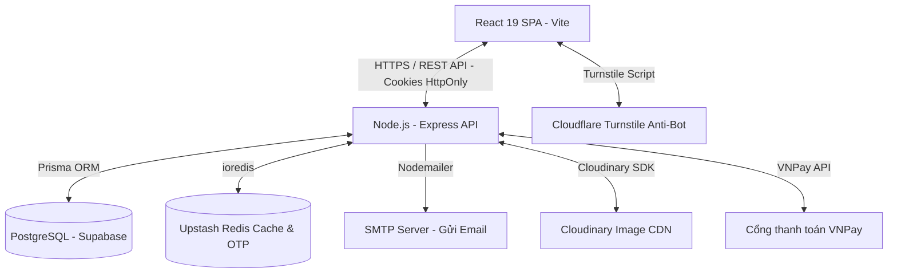

# 🏥 TỔNG QUAN HỆ THỐNG Y TẾ SỐ HEALTHCARE

Hệ thống **HealthCare** là một nền tảng Web đặt lịch khám bệnh trực tuyến và quản lý phòng khám thông minh. Được phát triển theo mô hình **Client-Server** hiện đại, hệ thống giải quyết các vấn đề đặt lịch, thanh toán, kê đơn và lưu trữ bệnh án số, hướng tới mô hình phòng khám số hóa (O2O - Online-to-Offline).

Hệ thống phục vụ 3 nhóm đối tượng người dùng chính với các đặc quyền và giao diện được phân tách rõ ràng:
1. **Bệnh nhân (Patient)**
2. **Bác sĩ (Doctor)**
3. **Quản trị viên (Admin)**

---

## 🏗️ Kiến Trúc Hệ Thống & Mô Hình Hoạt Động

Dự án được xây dựng tách biệt thành hai thành phần chính:
*   **Client (Frontend)**: Chạy trên cổng `5173` (môi trường dev). Là ứng dụng Single Page Application (SPA) xây dựng bằng React 19, tối ưu hóa giao diện người dùng và quản lý trạng thái client-side mượt mà.
*   **Server (Backend)**: Chạy trên cổng `5000` (môi trường dev). Là RESTful API Service xây dựng bằng Node.js + Express, xử lý toàn bộ logic nghiệp vụ, giao tiếp với các dịch vụ bên thứ ba (VNPay, Cloudinary, Redis, Email) và tương tác với Database thông qua Prisma ORM.

---

## ⚡ Các Tính Năng Chính Theo Vai Trò (Core Functions)

### 1. Phân Hệ Bệnh Nhân (Patient App)
*   **Đăng nhập & Bảo mật**: Đăng nhập qua Cookie HttpOnly an toàn. Đăng ký tài khoản mới và lấy lại mật khẩu thông qua cơ chế gửi OTP qua Email và xác thực bằng Redis (thời hạn 5 phút).
*   **Tìm kiếm & Tra cứu**:
    *   Xem danh sách các Chuyên khoa (Răng hàm mặt, Tai mũi họng, Da liễu, v.v.).
    *   Xem danh sách và bộ lọc Bác sĩ theo Chuyên khoa hoặc tìm kiếm theo tên.
    *   Xem chi tiết hồ sơ Bác sĩ (học vị, giá khám, mô tả, lịch rảnh).
*   **Đặt lịch khám trực tuyến**:
    *   Chọn ngày khám và khung giờ khám còn trống của bác sĩ.
    *   Điền lý do khám bệnh.
    *   Lựa chọn hình thức thanh toán: **Thanh toán trực tuyến qua VNPay** hoặc **Thanh toán tại phòng khám (Offline)**.
*   **Quản lý lịch hẹn**: Theo dõi trạng thái lịch khám cá nhân (Chờ thanh toán, Đã xác nhận, Đã hoàn thành, Đã hủy).
*   **Nhận đơn thuốc & Bệnh án**: Xem kết quả chẩn đoán và đơn thuốc điện tử (tên thuốc, liều dùng, ghi chú) ngay trên giao diện sau khi hoàn thành ca khám. Đồng thời, hệ thống tự động gửi một bản sao đơn thuốc HTML về email đăng ký.
*   **Quản lý thông tin cá nhân**: Cập nhật ảnh đại diện (upload lên Cloudinary), ngày sinh, giới tính, số điện thoại, địa chỉ.

### 2. Phân Hệ Bác Sĩ (Doctor Portal)
*   **Quản lý Lịch làm việc**: Bác sĩ tự đăng ký ca trực (theo ngày và khung giờ y tế) mà mình có thể khám.
*   **Xem & Quản lý lịch hẹn**:
    *   Xem danh sách bệnh nhân đã đặt lịch hẹn với mình theo từng trạng thái.
    *   Xác nhận ca khám khi bệnh nhân đến hoặc cập nhật trạng thái.
*   **Khám bệnh & Kê đơn thuốc**:
    *   Giao diện nhập chẩn đoán bệnh án và ghi chú của bác sĩ.
    *   Kê đơn thuốc động: chọn tên thuốc, nhập số lượng, đơn giá và hướng dẫn sử dụng chi tiết (liều dùng). Hệ thống tự tính tổng tiền thuốc.
    *   Sau khi lưu đơn thuốc, trạng thái lịch hẹn tự động chuyển sang **Đã hoàn thành (COMPLETED)** và hệ thống kích hoạt gửi email đơn thuốc cho bệnh nhân.
*   **Hồ sơ bác sĩ**: Tùy chỉnh thông tin chuyên môn, học vị và giá khám cá nhân.

### 3. Phân Hệ Quản Trị Viên (Admin Dashboard)
*   **Dashboard Thống kê**: Biểu đồ trực quan hóa doanh thu phòng khám, số lượng lịch hẹn, số lượng tài khoản mới theo thời gian. Toàn bộ dữ liệu thống kê được cache tại Redis để tối ưu hóa hiệu suất truy vấn.
*   **Quản lý Chuyên khoa**: CRUD (Thêm, sửa, xóa, xem) các chuyên khoa y tế kèm hình ảnh đại diện chuyên khoa.
*   **Quản lý Bác sĩ**:
    *   CRUD thông tin bác sĩ.
    *   Cập nhật thông tin tài khoản đăng nhập hệ thống cho bác sĩ và liên kết với hồ sơ chuyên môn của họ.
*   **Quản lý Bệnh nhân**: Xem danh sách bệnh nhân, thông tin liên hệ và lịch sử khám của từng bệnh nhân.
*   **Quản lý Lịch hẹn toàn phòng khám**: Theo dõi tất cả các lịch hẹn trong hệ thống, hỗ trợ hủy lịch hoặc điều chỉnh trạng thái khi cần thiết.
*   **Quản lý Câu hỏi thường gặp (FAQ)**: CRUD các câu hỏi và câu trả lời thường gặp trên trang chủ để hỗ trợ bệnh nhân.

---

## 🛠️ Công Nghệ & Thư Viện Sử Dụng (Tech Stack)

### 1. Frontend (Client-side)
*   **React 19.2**: Thư viện UI cốt lõi với hiệu năng render tối ưu.
*   **Vite 7.3**: Build tool và môi trường chạy dev siêu nhanh.
*   **Tailwind CSS 4.2**: Engine CSS thế hệ mới, tối ưu hóa CSS bundle và hỗ trợ Design System nhất quán.
*   **React Router DOM 7.13**: Điều hướng (routing) phía client, phân chia Route công khai và Route bảo vệ (Private/Protected Routes) theo vai trò.
*   **Zustand 5.0**: Quản lý Client State (thông tin người dùng đã đăng nhập, theme, đóng mở sidebar) gọn nhẹ hơn nhiều so với Redux. Kết hợp `persist` localStorage chống mất state khi F5.
*   **TanStack React Query 5.90**: Quản lý Server State, tự động cache dữ liệu API trên RAM client, giảm thiểu số lượng request trùng lặp và tự động cập nhật ngầm (stale-while-revalidate).
*   **Axios 1.13**: Thư viện gửi HTTP Request, cấu hình tự động gửi cookie (`withCredentials: true`) và Interceptors để xử lý lỗi hoặc làm mới Access Token tự động.
*   **React Hook Form 7.71 & Zod 4.3**: Quản lý form không cần render lại toàn bộ trang (Uncontrolled Components) và kiểm tra định dạng dữ liệu ngay tại client (client-side validation).
*   **Cloudflare Turnstile (@marsidev/react-turnstile 1.5)**: Tích hợp widget CAPTCHA không xâm lấn, chống bot spam trên form Auth.
*   **React Toastify 11.0**: Hiển thị thông báo đẹp mắt và trực quan cho người dùng.

### 2. Backend (Server-side)
*   **Node.js & Express 4.21**: Môi trường chạy và framework viết RESTful API gọn nhẹ, dễ mở rộng.
*   **Prisma 6.4 ORM**: Bộ công cụ truy vấn dữ liệu mạnh mẽ, ánh xạ đối tượng JS/TS sang PostgreSQL mà không cần viết SQL thuần. Hỗ trợ tự sinh kiểu dữ liệu (Type-safe).
*   **JSON Web Token (jsonwebtoken 9.0)**: Tạo mã xác thực an toàn cho người dùng.
*   **bcryptjs 2.4**: Băm mật khẩu người dùng trước khi lưu vào cơ sở dữ liệu bằng thuật toán Salted bcrypt.
*   **Zod 3.24**: Xác thực định dạng dữ liệu đầu vào tại API (Server-side validation) để bảo vệ hệ thống khỏi mã độc hoặc lỗi logic.
*   **vnpay 2.5 SDK**: Tích hợp thanh toán an toàn với cổng VNPay.
*   **ioredis 5.10**: Thư viện kết nối Redis hiệu năng cao, hỗ trợ lưu trữ cache và khóa tạm.
*   **Cloudinary SDK & Multer Storage Cloudinary 4.0**: Nhận file ảnh từ client gửi lên và lưu trữ trực tiếp lên đám mây Cloudinary, lấy về đường dẫn CDN.
*   **Nodemailer 8.0**: Gửi email thông báo tự động (Mã OTP, Chi tiết đơn thuốc định dạng HTML).
*   **Bảo mật**:
    *   `cors`: Cấu hình chia sẻ tài nguyên nguồn gốc chéo an toàn.
    *   `helmet`: Thiết lập các HTTP headers bảo mật (chống clickjacking, XSS injection...).
    *   `express-rate-limit`: Giới hạn tần suất gửi request từ một IP để ngăn chặn tấn công DDoS/Spam API.

### 3. Database & Dịch Vụ Đám Mây (Cloud Services)
*   **PostgreSQL**: Hệ quản trị cơ sở dữ liệu quan hệ mạnh mẽ, đảm bảo tính nhất quán của giao dịch (ACID).
*   **Supabase PostgreSQL (Cloud)**: Dịch vụ lưu trữ cơ sở dữ liệu PostgreSQL trên đám mây với độ tin cậy và băng thông cao.
*   **Upstash Redis (Serverless Redis)**: Nơi lưu trữ mã OTP xác minh, lưu vết phiên làm việc và cache các dữ liệu nặng (như Dashboard dữ liệu của Admin) với tốc độ phản hồi cực nhanh (<5ms).
*   **Cloudinary (Image Storage)**: Dịch vụ lưu trữ đám mây chuyên dụng cho hình ảnh, tự động nén, cắt cúp và tối ưu dung lượng ảnh (CDN).

---

## 🗄️ Thiết Kế Cơ Sở Dữ Liệu (12 Bảng - PostgreSQL)

Hệ thống có cấu trúc cơ sở dữ liệu chặt chẽ gồm **12 thực thể chính** thông qua Prisma ORM:

| Tên Bảng (Model) | Mô Tả Chức Năng |
| :--- | :--- |
| **`TaiKhoan`** | Lưu trữ thông tin đăng nhập (email, mật khẩu băm, refreshToken, vai trò ADMIN/DOCTOR/PATIENT, trạng thái, ảnh đại diện, thông tin cá nhân). |
| **`ChuyenKhoa`** | Danh mục các chuyên khoa (tên chuyên khoa, hình ảnh, mô tả, thời lượng khám trung bình). |
| **`BacSi`** | Thông tin chi tiết của bác sĩ (họ tên, học vị, mô tả chuyên môn, giá khám, liên kết đến `TaiKhoan` và `ChuyenKhoa`). |
| **`BenhNhan`** | Thông tin chi tiết của bệnh nhân (họ tên, số điện thoại liên hệ, email liên hệ, liên kết đến `TaiKhoan`). |
| **`KhungGio`** | Danh mục giờ khám mẫu cố định (ví dụ: ca 8:00 - 9:00, 9:00 - 10:00). |
| **`LichLamViecBacSi`** | Lịch trực thực tế của bác sĩ (ngày khám, khung giờ khám đăng ký, số lượng bệnh nhân tối đa/hiện tại). |
| **`HinhThucThanhToan`** | Hình thức thanh toán hỗ trợ (VNPay, Offline). |
| **`DatLich`** | Lịch đặt khám của bệnh nhân (ngày đặt, giờ bắt đầu/kết thúc, lý do khám, giá khám tại thời điểm đặt, trạng thái khám, trạng thái thanh toán, liên kết đến `BacSi`, `BenhNhan`, `LichLamViecBacSi`). |
| **`GiaoDich`** | Nhật ký giao dịch VNPay (số tiền, mã giao dịch VNPay, mã tham chiếu hệ thống, loại giao dịch PHI_KHAM/DON_THUOC, trạng thái giao dịch). |
| **`DonThuoc`** | Thông tin chung của đơn thuốc sau khi khám (chẩn đoán bệnh, ghi chú của bác sĩ, tổng tiền thuốc, liên kết với ca khám `DatLich`). |
| **`ChiTietDonThuoc`** | Danh sách thuốc trong đơn (tên thuốc, số lượng kê, đơn giá thuốc, liều dùng hướng dẫn, ghi chú thuốc). |
| **`CauHoiThuongGap`** | Danh sách câu hỏi FAQ hỗ trợ giải đáp thắc mắc của bệnh nhân. |

### 🔗 Mối Quan Hệ Chính Trong Cơ Sở Dữ Liệu:
- **1-1 (Một - Một)**:
  - `TaiKhoan` ↔ `BacSi` (Tài khoản bác sĩ chỉ liên kết với một thông tin bác sĩ duy nhất).
  - `TaiKhoan` ↔ `BenhNhan` (Tài khoản bệnh nhân chỉ liên kết với một thông tin bệnh nhân duy nhất).
  - `DatLich` ↔ `DonThuoc` (Mỗi lịch hẹn hoàn thành chỉ có tối đa một đơn thuốc).
- **1-N (Một - Nhiều)**:
  - `ChuyenKhoa` ↔ `BacSi` (Một chuyên khoa có nhiều bác sĩ).
  - `BacSi` ↔ `LichLamViecBacSi` (Một bác sĩ có nhiều ca trực đăng ký).
  - `KhungGio` ↔ `LichLamViecBacSi` (Một khung giờ được áp dụng cho nhiều lịch làm việc của nhiều bác sĩ khác nhau).
  - `BacSi` / `BenhNhan` ↔ `DatLich` (Bác sĩ/Bệnh nhân có nhiều lịch hẹn đặt khám).
  - `DatLich` ↔ `GiaoDich` (Một lịch hẹn có thể phát sinh nhiều giao dịch thanh toán trực tuyến, ví dụ thanh toán tiền khám rồi sau đó thanh toán tiền thuốc).
  - `DonThuoc` ↔ `ChiTietDonThuoc` (Một đơn thuốc chứa nhiều loại thuốc chi tiết).

---

## 🔒 Các Cơ Chế Kỹ Thuật Nổi Bật (Advanced Features)

> [!NOTE]
> Đây là các giải pháp công nghệ nâng cao giúp hệ thống đạt độ tin cậy và hiệu năng cao, thường được Hội đồng bảo vệ đánh giá rất cao.

### 1. Cơ Chế Xác Thực Kép (Dual JWT HttpOnly Cookie & Token Rotation)
- **An toàn tuyệt đối trước XSS**: Access Token và Refresh Token không được lưu trong `localStorage` hay `sessionStorage` (vì dễ bị mã độc JavaScript đánh cắp). Thay vào đó, chúng được lưu trong **HttpOnly Cookie** từ Backend gửi về, trình duyệt tự động gửi kèm theo các request mà JavaScript không thể đọc/ghi được.
- **Cơ chế Token Rotation**: Khi Access Token hết hạn, client tự động gửi Refresh Token lên để đổi lấy cặp Access/Refresh Token mới. Nếu phát hiện Refresh Token cũ bị tái sử dụng (nghi ngờ bị tấn công replay), hệ thống lập tức thu hồi toàn bộ phiên làm việc của tài khoản đó.

### 2. Cổng Thanh Toán VNPay & Cơ chế IPN (Instant Payment Notification)
- **Bảo mật giao dịch**: Sử dụng thuật toán băm bảo mật **HMAC-SHA512** kèm theo mã bảo mật (HashSecret) để ký và đối chiếu thông tin giao dịch giữa hệ thống phòng khám và cổng thanh toán VNPay, ngăn ngừa gian lận sửa đổi số tiền trên Client.
- **Cơ chế IPN**: Backend cung cấp một API IPN đặc biệt để VNPay gọi trực tiếp (Server-to-Server) cập nhật kết quả thanh toán. Cơ chế này đảm bảo ngay cả khi bệnh nhân tắt trình duyệt lúc đang thanh toán, trạng thái giao dịch vẫn được cập nhật chính xác và an toàn vào database.

### 3. Khiên Chống Bot Cloudflare Turnstile & OTP Redis
- **Chống spam**: Form đăng nhập/đăng ký tích hợp Cloudflare Turnstile hoạt động ngầm phân tích hành vi người dùng không xâm lấn. Token gửi lên Backend được kiểm tra trực tiếp qua API Cloudflare, đảm bảo chỉ có người dùng thật mới có thể submit form.
- **Xác thực OTP thời gian thực**: Khi yêu cầu cấp lại mật khẩu, hệ thống sinh mã OTP ngẫu nhiên gửi qua Nodemailer. Mã OTP được lưu trữ trong Upstash Redis với thời gian sống (TTL) 5 phút. Khi người dùng nhập OTP, backend truy vấn Redis cực nhanh để xác minh, tránh việc ghi/xóa dữ liệu rác liên tục vào PostgreSQL.

### 4. Tăng Tốc Với Bộ Nhớ Đệm Upstash Redis Caching
- **Tối ưu hóa Database**: Các dữ liệu ít biến động nhưng tần suất truy cập cao (danh sách bác sĩ, danh mục chuyên khoa, biểu đồ thống kê doanh thu của Admin) được lưu vào Redis Cache.
- **Đồng bộ hóa dữ liệu**: Khi Admin hoặc Bác sĩ thay đổi thông tin (ví dụ: CRUD Bác sĩ), backend tự động invalidate (xóa) cache tương ứng trong Redis để ở lần truy cập tiếp theo hệ thống sẽ lấy dữ liệu mới từ PostgreSQL và ghi đè cache mới.

---

## 💻 Công Cụ Phát Triển & Vận Hành (Developer Tools)

Để phát triển và kiểm thử dự án này, các công cụ sau đã được sử dụng:
1. **Visual Studio Code (VS Code)**: Trình soạn thảo mã nguồn chính, tích hợp ESLint và Prettier để đảm bảo chuẩn hóa code format.
2. **Postman**: Công cụ thiết kế và chạy thử nghiệm 65 API Endpoints của hệ thống. Lưu trữ các collection API có sẵn biến môi trường để test nhanh.
3. **Prisma Studio**: Trình quản trị cơ sở dữ liệu giao diện trực quan (GUI) chạy local bằng lệnh `npm run prisma:studio`. Cho phép xem, sửa và tạo dữ liệu thủ công nhanh chóng.
4. **Supabase Console & Upstash Console**: Trang quản trị trực tuyến dịch vụ PostgreSQL và Redis trên Cloud để giám sát hoạt động truy vấn và kết nối của server.
5. **Git & GitHub**: Quản lý phiên bản mã nguồn, theo dõi lịch sử commit và phối hợp làm việc.

---
> 📌 *Tài liệu tóm tắt hệ thống này được soạn thảo phục vụ cho quá trình ôn tập bảo vệ Đồ án tốt nghiệp ngành Công nghệ thông tin.*
