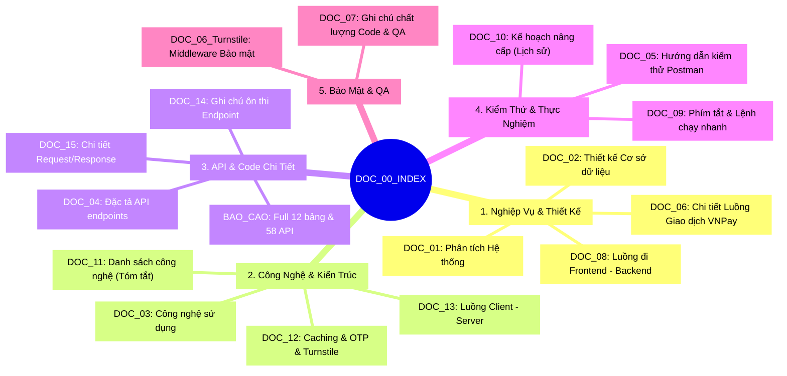

# 🗺️ BẢN ĐỒ TÀI LIỆU ĐỒ ÁN TỐT NGHIỆP (DOC_00)
> **HealthCare Project — Hệ Thống Đặt Lịch Khám & Quản Lý Phòng Khám**
>
> Tài liệu này đóng vai trò là **"Sổ Tay Tra Cứu Nhanh"** giúp bạn định vị chính xác nhiệm vụ, nội dung và thời điểm cần mở của 17 tài liệu kỹ thuật khác trong thư mục `docx/`. Giúp bạn tự tin trả lời bất kỳ câu hỏi nào từ Hội đồng bảo vệ đồ án!

---

## 🧭 Bản đồ Phân Loại Tài Liệu Theo Mục Đích

Để dễ tìm kiếm khi bị hỏi, các tài liệu được chia thành **5 Nhóm nghiệp vụ chính**:

---

## 📊 Bảng Tra Cứu Nhanh 17 Tài Liệu

| Ký Hiệu Tài Liệu | Tên Tài Liệu | Tóm Tắt Nhiệm Vụ & Nội Dung | 💡 Khi Nào Cần Mở? |
| :--- | :--- | :--- | :--- |
| **DOC_00** | **Bản Đồ Tài Liệu (Tài liệu này)** | Tổng quan, phân loại và hướng dẫn định vị nhanh toàn bộ hệ thống tài liệu. | **Khi bắt đầu ôn tập** hoặc cần tìm tài liệu phù hợp. |
| **DOC_01** | [Phân tích Hệ thống](file:///c:/Users/hbui2/OneDrive%20-%20Hanoi%20University%20of%20Mining%20and%20Geology/Trường%20Đại%20Học%20Mỏ%20Địa%20Chất/Năm%20Học%202025%20-%202026/Đồ%20Án%20Tốt%20Nghiệp/CodeDoAnTotNghiep/docx/DOC_01_SYSTEM_ANALYSIS.md) | Phân tích nghiệp vụ, tác nhân (Actors), ca sử dụng (Use Cases), sơ đồ phân rã chức năng. | Khi thầy hỏi về **phương pháp luận**, phân tích thiết kế hệ thống. |
| **DOC_02** | [Thiết kế Cơ sở dữ liệu](file:///c:/Users/hbui2/OneDrive%20-%20Hanoi%20University%20of%20Mining%20and%20Geology/Trường%20Đại%20Học%20Mỏ%20Địa%20Chất/Năm%20Học%202025%20-%202026/Đồ%20Án%20Tốt%20Nghiệp/CodeDoAnTotNghiep/docx/DOC_02_DATABASE_DESIGN.md) | Chi tiết thiết kế các bảng dữ liệu bằng mã Markdown và sơ đồ Mermaid ERD. | Khi thầy hỏi về **cơ sở dữ liệu**, liên kết các bảng (Foreign Keys). |
| **DOC_03** | [Kiến Trúc & Công Nghệ](file:///c:/Users/hbui2/OneDrive%20-%20Hanoi%20University%20of%20Mining%20and%20Geology/Trường%20Đại%20Học%20Mỏ%20Địa%20Chất/Năm%20Học%202025%20-%202026/Đồ%20Án%20Tốt%20Nghiệp/CodeDoAnTotNghiep/docx/DOC_03_TECH_STACK.md) | Mô tả sâu cấu trúc kiến trúc Layered Architecture của dự án và tech stack chi tiết. | Khi thầy hỏi **tại sao lại chọn kiến trúc này / thư viện này**. |
| **DOC_04** | [Đặc Tả Endpoints API](file:///c:/Users/hbui2/OneDrive%20-%20Hanoi%20University%20of%20Mining%20and%20Geology/Trường%20Đại%20Học%20Mỏ%20Địa%20Chất/Năm%20Học%202025%20-%202026/Đồ%20Án%20Tốt%20Nghiệp/CodeDoAnTotNghiep/docx/DOC_04_API_SPECIFICATION.md) | Danh sách 58 endpoints API phân chia theo từng module cụ thể (Auth, Bác sĩ, Bệnh nhân...). | Khi thầy hỏi **"Hệ thống có bao nhiêu API? Kể tên các API chính"**. |
| **DOC_05** | [Hướng Dẫn Kiểm Thử (Testing)](file:///c:/Users/hbui2/OneDrive%20-%20Hanoi%20University%20of%20Mining%20and%20Geology/Trường%20Đại%20Học%20Mỏ%20Địa%20Chất/Năm%20Học%202025%20-%202026/Đồ%20Án%20Tốt%20Nghiệp/CodeDoAnTotNghiep/docx/DOC_05_TESTING_GUIDE.md) | Quy trình test từng bước bằng Postman kèm Request/Response mẫu. **Cực kỳ quan trọng để thực hành test**. | Khi cần **chạy test thử**, thiết lập môi trường Postman, chụp ảnh minh họa. |
| **DOC_06 (VNPay)** | [Luồng Giao Dịch VNPay](file:///c:/Users/hbui2/OneDrive%20-%20Hanoi%20University%20of%20Mining%20and%20Geology/Trường%20Đại%20Học%20Mỏ%20Địa%20Chất/Năm%20Học%202025%20-%202026/Đồ%20Án%20Tốt%20Nghiệp/CodeDoAnTotNghiep/docx/DOC_06_PAYMENT_FLOW.md) | Sơ đồ Sequence Diagram thể hiện tương tác thanh toán online và giải thích cơ chế bảo mật chữ ký HMAC. | Khi thầy hỏi **"Luồng VNPay của em chạy như thế nào? Bảo mật ra sao?"**. |
| **DOC_06 (Turnstile)** | [Khiên Turnstile & OTP](file:///c:/Users/hbui2/OneDrive%20-%20Hanoi%20University%20of%20Mining%20and%20Geology/Trường%20Đại%20Học%20Mỏ%20Địa%20Chất/Năm%20Học%202025%20-%202026/Đồ%20Án%20Tốt%20Nghiệp/CodeDoAnTotNghiep/docx/DOC_06_SECURITY_TURNSTILE.md) | Phân tích cơ chế chống brute-force bằng Cloudflare Turnstile và bảo mật quên mật khẩu OTP bằng Redis. | Khi thầy hỏi về **bảo mật / cơ chế chống spam login**. |
| **DOC_07** | [QA & Chất Lượng Code](file:///c:/Users/hbui2/OneDrive%20-%20Hanoi%20University%20of%20Mining%20and%20Geology/Trường%20Đại%20Học%20Mỏ%20Địa%20Chất/Năm%20Học%202025%20-%202026/Đồ%20Án%20Tốt%20Nghiệp/CodeDoAnTotNghiep/docx/DOC_07_CODE_QA_NOTES.md) | Tài liệu cực kỳ chi tiết phân tích lỗi, tối ưu hóa database, và chất lượng code dự án. | Đọc để **nâng cao kiến thức chuyên sâu**, trả lời câu hỏi khó của thầy phản biện. |
| **DOC_08** | [Luồng Nghiệp Vụ Chức Năng](file:///c:/Users/hbui2/OneDrive%20-%20Hanoi%20University%20of%20Mining%20and%20Geology/Trường%20Đại%20Học%20Mỏ%20Địa%20Chất/Năm%20Học%202025%20-%202026/Đồ%20Án%20Tốt%20Nghiệp/CodeDoAnTotNghiep/docx/DOC_08_FUNCTION_FLOW.md) | Mô tả luồng đi từ Frontend (giao diện, nút bấm) đến Backend (Zod, Prisma) cho 17 chức năng chính. | Khi cần hiểu **sự kết nối giữa Giao diện và API**. |
| **DOC_09** | [Cheatsheet phím tắt & CLI](file:///c:/Users/hbui2/OneDrive%20-%20Hanoi%20University%20of%20Mining%20and%20Geology/Trường%20Đại%20Học%20Mỏ%20Địa%20Chất/Năm%20Học%202025%20-%202026/Đồ%20Án%20Tốt%20Nghiệp/CodeDoAnTotNghiep/docx/DOC_09_CHEATSHEET.md) | Tổng hợp các câu lệnh chạy dự án (Server, Client, Prisma, Redis) và các mẹo thao tác nhanh. | Khi cần **khởi động nhanh dự án** hoặc sửa chữa database bằng CLI. |
| **DOC_10** | [Kế Hoạch VNPay (Lịch Sử)](file:///c:/Users/hbui2/OneDrive%20-%20Hanoi%20University%20of%20Mining%20and%20Geology/Trường%20Đại%20Học%20Mỏ%20Địa%20Chất/Năm%20Học%202025%20-%202026/Đồ%20Án%20Tốt%20Nghiệp/CodeDoAnTotNghiep/docx/DOC_10_PAYMENT_IMPLEMENTATION_PLAN.md) | File kế hoạch tích hợp VNPay thời kỳ đầu (Giữ lại làm tài liệu tham khảo lịch sử phát triển code). | Tham khảo khi muốn xem **lịch sử thay đổi logic thanh toán**. |
| **DOC_11** | [Tóm Tắt Công Nghệ](file:///c:/Users/hbui2/OneDrive%20-%20Hanoi%20University%20of%20Mining%20and%20Geology/Trường%20Đại%20Học%20Mỏ%20Địa%20Chất/Năm%20Học%202025%20-%202026/Đồ%20Án%20Tốt%20Nghiệp/CodeDoAnTotNghiep/docx/DOC_11_TECH_LIST.md) | Danh sách ngắn gọn các thư viện npm đã sử dụng ở cả client & server cùng mục tiêu của chúng. | Để **học thuộc lòng các công nghệ** trước giờ G bảo vệ. |
| **DOC_12** | [Redis & Security](file:///c:/Users/hbui2/OneDrive%20-%20Hanoi%20University%20of%20Mining%20and%20Geology/Trường%20Đại%20Học%20Mỏ%20Địa%20Chất/Năm%20Học%202025%20-%202026/Đồ%20Án%20Tốt%20Nghiệp/CodeDoAnTotNghiep/docx/DOC_12_CACHE_SECURITY.md) | Phân tích sâu kiến trúc phân tán Redis Cache và cách thức hoạt động của cơ chế Dual JWT HttpOnly. | Khi thầy hỏi **"Em lưu JWT ở đâu? Token Rotation hoạt động thế nào?"**. |
| **DOC_13** | [Hướng Dẫn Client-Server Flow](file:///c:/Users/hbui2/OneDrive%20-%20Hanoi%20University%20of%20Mining%20and%20Geology/Trường%20Đại%20Học%20Mỏ%20Địa%20Chất/Năm%20Học%202025%20-%202026/Đồ%20Án%20Tốt%20Nghiệp/CodeDoAnTotNghiep/docx/DOC_13_CLIENT_SERVER_FLOW_GUIDE.md) | Hướng dẫn cách luồng dữ liệu chạy xuyên suốt qua Controller -> Service -> DB. | Khi bạn muốn **tự tay viết thêm tính năng mới** cho dự án. |
| **DOC_14** | [Ôn Tập Đầu Cuối Chuyên Sâu](file:///c:/Users/hbui2/OneDrive%20-%20Hanoi%20University%20of%20Mining%20and%20Geology/Trường%20Đại%20Học%20Mỏ%20Địa%20Chất/Năm%20Học%202025%20-%202026/Đồ%20Án%20Tốt%20Nghiệp/CodeDoAnTotNghiep/docx/DOC_14_ENDPOINT_STUDY_NOTES.md) | Phân tích sâu sắc các mối quan hệ DB phức tạp (1-N, N-N) và cơ chế khóa bệnh án khi chưa thanh toán. | Để **chuẩn bị câu trả lời hoàn hảo cho thầy phản biện**. |
| **DOC_15** | [Luồng API Từng Bước Một](file:///c:/Users/hbui2/OneDrive%20-%20Hanoi%20University%20of%20Mining%20and%20Geology/Trường%20Đại%20Học%20Mỏ%20Địa%20Chất/Năm%20Học%202025%20-%202026/Đồ%20Án%20Tốt%20Nghiệp/CodeDoAnTotNghiep/docx/DOC_15_API_STEP_BY_STEP.md) | Mô tả chi tiết từng Request/Response thực tế, cách cookie HttpOnly hoạt động. | Dùng để **trả lời hội đồng** khi bị hỏi "API này gửi gì, nhận gì, Zod validate gì". |
| **BÁO CÁO** | [Báo Cáo Dự Án Chi Tiết](file:///c:/Users/hbui2/OneDrive%20-%20Hanoi%20University%20of%20Mining%20and%20Geology/Trường%20Đại%20Học%20Mỏ%20Địa%20Chất/Năm%20Học%202025%20-%202026/Đồ%20Án%20Tốt%20Nghiệp/CodeDoAnTotNghiep/docx/BAO_CAO_DU_AN_CHI_TIET.md) | Bản tổng thể full 12 bảng PostgreSQL, 58 endpoints API, cấu trúc thư mục và Tech Stack. | Dùng làm **nội dung chính để in ấn quyển Báo cáo Đồ án Tốt nghiệp**. |

---

## 🎯 Cẩm Nang Ứng Phó Với Câu Hỏi Hội Đồng (Quick Cheat-Sheet)

> [!TIP]
> Dưới đây là các tình huống thường gặp khi đứng trước Hội đồng và tài liệu bạn cần mở ngay lập tức để làm "phao cứu sinh":

### 1. Thầy hỏi: *"Em vẽ Sơ đồ ERD hay giải thích mối quan hệ các bảng trong DB thế nào?"*
👉 **Tài liệu cần mở:** **[DOC_02_DATABASE_DESIGN.md](file:///c:/Users/hbui2/OneDrive%20-%20Hanoi%20University%20of%20Mining%20and%20Geology/Trường%20Đại%20Học%20Mỏ%20Địa%20Chất/Năm%20Học%202025%20-%202026/Đồ%20Án%20Tốt%20Nghiệp/CodeDoAnTotNghiep/docx/DOC_02_DATABASE_DESIGN.md)** hoặc **[BAO_CAO_DU_AN_CHI_TIET.md](file:///c:/Users/hbui2/OneDrive%20-%20Hanoi%20University%20of%20Mining%20and%20Geology/Trường%20Đại%20Học%20Mỏ%20Địa%20Chất/Năm%20Học%202025%20-%202026/Đồ%20Án%20Tốt%20Nghiệp/CodeDoAnTotNghiep/docx/BAO_CAO_DU_AN_CHI_TIET.md#3-chi-tiet-co-so-du-lieu-postgresql---12-bang)**.
*   **Điểm mấu chốt:** Nắm chắc mối quan hệ giữa các bảng `DatLich` (lịch hẹn), `GiaoDich` (log thanh toán), `HinhThucThanhToan`, `DonThuoc` và `ChiTietDonThuoc`.

### 2. Thầy hỏi: *"Hãy giải thích luồng thanh toán VNPay? Tại sao thanh toán an toàn?"*
👉 **Tài liệu cần mở:** **[DOC_06_PAYMENT_FLOW.md](file:///c:/Users/hbui2/OneDrive%20-%20Hanoi%20University%20of%20Mining%20and%20Geology/Trường%20Đại%20Học%20Mỏ%20Địa%20Chất/Năm%20Học%202025%20-%202026/Đồ%20Án%20Tốt%20Nghiệp/CodeDoAnTotNghiep/docx/DOC_06_PAYMENT_FLOW.md)** và **[DOC_08_FUNCTION_FLOW.md](file:///c:/Users/hbui2/OneDrive%20-%20Hanoi%20University%20of%20Mining%20and%20Geology/Trường%20Đại%20Học%20Mỏ%20Địa%20Chất/Năm%20Học%202025%20-%202026/Đồ%20Án%20Tốt%20Nghiệp/CodeDoAnTotNghiep/docx/DOC_08_FUNCTION_FLOW.md#17-luong-thanh-toan-online-vnpay)**.
*   **Điểm mấu chốt:** Trả lời về chữ ký bảo mật **HMAC-SHA512** (SecureHash) và cơ chế **IPN** (Server-to-Server ngầm), đảm bảo người dùng không thể can thiệp sửa đổi kết quả thanh toán trên Frontend.

### 3. Thầy hỏi: *"API Đặt lịch nhận tham số gì? Server xử lý qua những bước nào?"*
👉 **Tài liệu cần mở:** **[DOC_15_API_STEP_BY_STEP.md](file:///c:/Users/hbui2/OneDrive%20-%20Hanoi%20University%20of%20Mining%20and%20Geology/Trường%20Đại%20Học%20Mỏ%20Địa%20Chất/Năm%20Học%202025%20-%202026/Đồ%20Án%20Tốt%20Nghiệp/CodeDoAnTotNghiep/docx/DOC_15_API_STEP_BY_STEP.md#c2-dat-lich-moi-post)**.
*   **Điểm mấu chốt:** Gửi `ngayDat`, `gioBatDau`, `bacSiId`, `benhNhanId`, `lyDoKham`. Đi qua 6 bước xử lý bao gồm phân quyền, validate Zod, tự tính giờ kết thúc, kiểm tra ca làm việc, kiểm tra trùng lịch và chạy Transaction an toàn.

### 4. Thầy hỏi: *"Bảo mật JWT của em lưu trữ ở đâu? Khác gì LocalStorage?"*
👉 **Tài liệu cần mở:** **[DOC_12_CACHE_SECURITY.md](file:///c:/Users/hbui2/OneDrive%20-%20Hanoi%20University%20of%20Mining%20and%20Geology/Trường%20Đại%20Học%20Mỏ%20Địa%20Chất/Năm%20Học%202025%20-%202026/Đồ%20Án%20Tốt%20Nghiệp/CodeDoAnTotNghiep/docx/DOC_12_CACHE_SECURITY.md)** hoặc **[DOC_15_API_STEP_BY_STEP.md](file:///c:/Users/hbui2/OneDrive%20-%20Hanoi%20University%20of%20Mining%20and%20Geology/Trường%20Đại%20Học%20Mỏ%20Địa%20Chất/Năm%20Học%202025%20-%202026/Đồ%20Án%20Tốt%20Nghiệp/CodeDoAnTotNghiep/docx/DOC_15_API_STEP_BY_STEP.md#a3-xac-thuc-trong-project-nay-quan-trong)**.
*   **Điểm mấu chốt:** Token được lưu trữ trong **HttpOnly Cookie** (không lưu ở localStorage). Giúp chống lại hoàn toàn các cuộc tấn công **XSS** (Cross-Site Scripting) vì mã JavaScript của hacker không thể đọc được cookie này. Đồng thời sử dụng cơ chế **Token Rotation** để liên tục làm mới session bảo mật.

---

> [!NOTE]
> *Bản đồ tra cứu DOC_00 này được biên soạn bởi trợ lý AI Antigravity, được cập nhật theo luồng nghiệp vụ mới nhất phục vụ hoàn hảo cho buổi bảo vệ đồ án tốt nghiệp của bạn.*
