# PHÂN TÍCH VÀ THIẾT KẾ HỆ THỐNG

## Website Đặt Lịch Khám Bệnh Trực Tuyến — ClinicBooking

> Tài liệu phân tích thiết kế hệ thống phục vụ báo cáo đồ án tốt nghiệp.
> **Lưu ý**: Xem lộ trình chi tiết và hồ sơ học thuật tại thư mục [PHỤ LỤC ĐỒ ÁN](./PHU_LUC_DO_AN/PHU_LUC_01_LO_TRINH_10_TUAN.md).

---

## Mục lục

1. [Tổng quan hệ thống](#1-tổng-quan-hệ-thống)
2. [Phân tích yêu cầu](#2-phân-tích-yêu-cầu)
3. [Kiến trúc hệ thống](#3-kiến-trúc-hệ-thống)
4. [Phân tích Actor](#4-phân-tích-actor)
5. [Biểu đồ Use Case](#5-biểu-đồ-use-case)
6. [Đặc tả Use Case chi tiết](#6-đặc-tả-use-case-chi-tiết)
7. [Biểu đồ hoạt động](#7-biểu-đồ-hoạt-động-activity-diagram)
8. [Biểu đồ tuần tự](#8-biểu-đồ-tuần-tự-sequence-diagram)
9. [Biểu đồ trạng thái](#9-biểu-đồ-trạng-thái-state-diagram)
10. [Thiết kế cơ sở dữ liệu](#10-thiết-kế-cơ-sở-dữ-liệu)
11. [Thiết kế API](#11-thiết-kế-api)
12. [Thiết kế bảo mật](#12-thiết-kế-bảo-mật)
13. [Kết luận](#13-kết-luận)

---

## 1. Tổng quan hệ thống

### 1.1 Giới thiệu

Hệ thống **ClinicBooking** là website đặt lịch khám bệnh trực tuyến dành cho phòng khám, cho phép bệnh nhân tìm kiếm bác sĩ theo chuyên khoa, đặt lịch khám theo ngày và khung giờ. Hệ thống phục vụ 3 nhóm người dùng: **Bệnh nhân**, **Bác sĩ** và **Quản trị viên (Admin)**.

### 1.2 Mục tiêu

- Xây dựng nền tảng đặt lịch khám trực tuyến giúp giảm thời gian đặt lịch thủ công.
- Đảm bảo lịch hẹn không bị trùng, bác sĩ chỉ nhận bệnh nhân đúng khung giờ sẵn sàng.
- Phân quyền rõ ràng theo vai trò với kiểm tra quyền sở hữu (ownership check).
- Bảo mật bằng cơ chế xác thực JWT kép (Access Token + Refresh Token Rotation).
- Dữ liệu lưu bền vững trên PostgreSQL (Supabase).

### 1.3 Phạm vi

| Đăng ký / Đăng nhập / Phân quyền | Chat trực tuyến bác sĩ - bệnh nhân |
| Tìm kiếm bác sĩ theo chuyên khoa | Thông báo tự động qua SMS |
| Đặt lịch / Hủy lịch / Xem lịch sử | Hệ thống bảo hiểm y tế |
| Quản lý lịch làm việc bác sĩ | Tích hợp thiết bị y tế IoT |
| Kê đơn thuốc & Quản lý đơn | |
| Tích hợp Thanh toán Online (VNPay) | |
| Quản trị hệ thống (Admin) | |
| Thống kê báo cáo doanh thu | |

---

## 2. Phân tích yêu cầu

### 2.1 Yêu cầu chức năng

| STT | Nhóm | Yêu cầu |
|-----|-------|---------|
| YC01 | Auth | Đăng ký tài khoản bệnh nhân (email, mật khẩu, họ tên, SĐT) |
| YC02 | Auth | Đăng nhập bằng email + mật khẩu, phân luồng theo vai trò |
| YC03 | Auth | Làm mới access token bằng refresh token (tự động) |
| YC04 | Auth | Đăng xuất (xóa token) |
| YC05 | Auth | Xem/Cập nhật hồ sơ cá nhân, đổi mật khẩu |
| YC06 | Bệnh nhân | Xem danh sách chuyên khoa và bác sĩ theo chuyên khoa |
| YC07 | Bệnh nhân | Xem chi tiết bác sĩ (học vị, mô tả, giá khám, lịch trống) |
| YC08 | Bệnh nhân | Đặt lịch khám: chọn bác sĩ, ngày, khung giờ, lý do, hình thức thanh toán |
| YC09 | Bệnh nhân | Xem lịch sử lịch hẹn + kết quả khám / đơn thuốc |
| YC10 | Bệnh nhân | Hủy lịch hẹn (khi trạng thái cho phép) |
| YC11 | Bác sĩ | Thiết lập lịch làm việc theo ngày + khung giờ |
| YC12 | Bác sĩ | Xem và xử lý lịch hẹn, cập nhật trạng thái |
| YC13 | Bác sĩ | Kê đơn thuốc sau khi khám xong |
| YC14 | Admin | CRUD chuyên khoa, bác sĩ, bệnh nhân, FAQ, hình thức thanh toán |
| YC15 | Admin | Xem tất cả lịch hẹn, cập nhật trạng thái |
| YC16 | Admin | Dashboard thống kê tổng quan và theo khoảng thời gian |

### 2.2 Yêu cầu phi chức năng

| Yêu cầu | Mô tả |
|----------|-------|
| Bảo mật | JWT kép, mật khẩu hash bcrypt, cookie HttpOnly, CORS |
| Hiệu năng | API response < 500ms, hỗ trợ nhiều người dùng đồng thời |
| Khả dụng | Triển khai trên cloud (Supabase), uptime cao |
| Dễ bảo trì | Kiến trúc phân tầng rõ ràng, code moduler |
| Giao diện | Responsive, thân thiện, dễ sử dụng trên mobile và desktop |

---

## 3. Kiến trúc hệ thống

### 3.1 Mô hình kiến trúc 3 tầng (Three-tier Architecture)

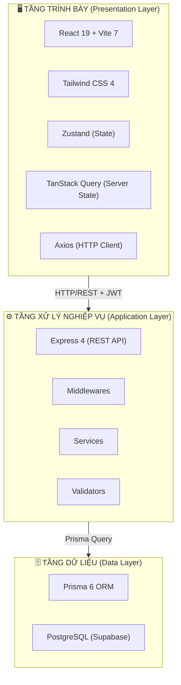

### 3.2 Kiến trúc Backend chi tiết

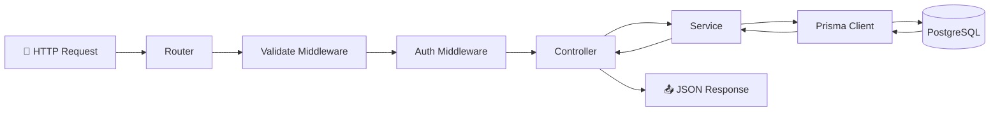

### 3.3 Công nghệ sử dụng

| Tầng | Công nghệ | Phiên bản | Mục đích |
|------|-----------|-----------|----------|
| Frontend | React | 19 | UI Framework |
| Frontend | Vite | 7 | Build tool & Dev server |
| Frontend | Tailwind CSS | 4 | CSS Framework |
| Frontend | React Router DOM | 7 | Routing |
| Frontend | Zustand | 5 | Client state management |
| Frontend | TanStack React Query | 5 | Server state & data fetching |
| Frontend | Axios | - | HTTP client |
| Frontend | React Hook Form | 7 | Quản lý form |
| Frontend | React Toastify | 11 | Thông báo |
| Backend | Express | 4 | Web framework |
| Backend | Prisma | 6 | ORM |
| Backend | jsonwebtoken | 9 | Xác thực JWT |
| Backend | bcryptjs | 2 | Hash mật khẩu |
| Backend | express-validator | 7 | Validate request |
| Backend | cors | 2 | CORS policy |
| Database | PostgreSQL | 15+ | RDBMS |
| Hosting | Supabase | - | Database cloud hosting |

---

## 4. Phân tích Actor

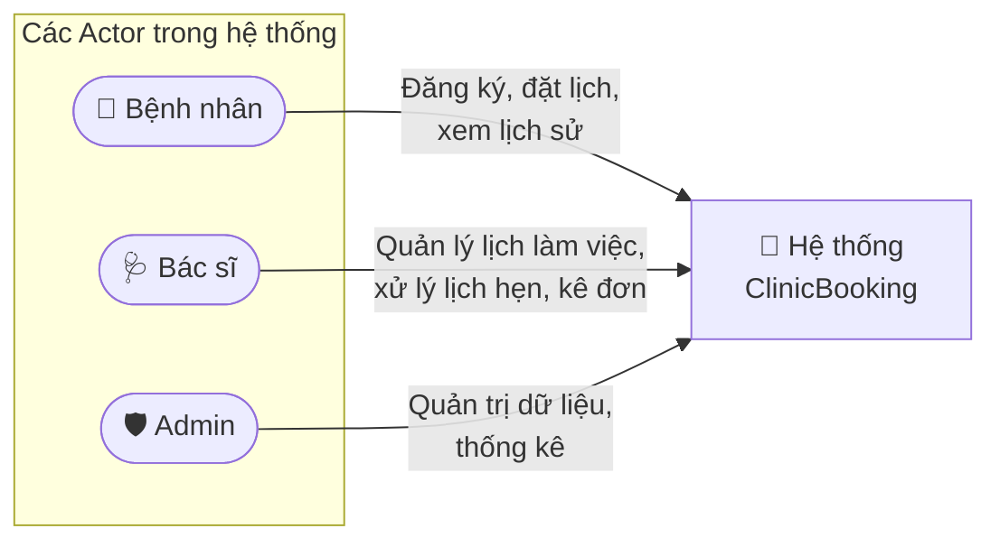

| Actor | Vai trò | Quyền hạn chính |
|-------|---------|-----------------|
| **Bệnh nhân** | Người sử dụng dịch vụ khám bệnh | Đăng ký/đăng nhập, tìm bác sĩ, đặt lịch, xem lịch sử, hủy lịch, xem đơn thuốc |
| **Bác sĩ** | Cung cấp dịch vụ khám bệnh | Đăng nhập, quản lý lịch làm việc, xem/xử lý lịch hẹn, kê đơn thuốc |
| **Admin** | Quản trị toàn bộ hệ thống | CRUD chuyên khoa/bác sĩ/bệnh nhân/FAQ, quản lý lịch hẹn, xem thống kê |

---

## 5. Biểu đồ Use Case

### 5.1 Use Case tổng quan

```mermaid
graph TB
    AD --- UC2 & UC3
    AD --- UC14 & UC16 & UC17 & UC18 & UC19 & UC20 & UC21

    subgraph system["Hệ thống ClinicBooking"]
        subgraph auth["Nhóm Auth"]
            UC1["UC01: Đăng ký"]
            UC2["UC02: Đăng nhập"]
            UC3["UC03: Đăng xuất"]
            UC4["UC04: Đổi mật khẩu"]
            UC5["UC05: Cập nhật hồ sơ"]
        end

        subgraph patient["Nhóm Bệnh nhân"]
            UC6["UC06: Xem chuyên khoa"]
            UC7["UC07: Tìm bác sĩ"]
            UC8["UC08: Đặt lịch khám"]
            UC9["UC09: Xem lịch sử"]
            UC10["UC10: Hủy lịch hẹn"]
            UC11["UC11: Xem kết quả khám"]
            UC22["UC22: Thanh toán Online"]
        end

        subgraph doctor["Nhóm Bác sĩ"]
            UC12["UC12: Quản lý lịch làm việc"]
            UC13["UC13: Xem lịch hẹn"]
            UC14["UC14: Cập nhật trạng thái"]
            UC15["UC15: Kê đơn thuốc"]
        end

        subgraph admin["Nhóm Admin"]
            UC16["UC16: Quản lý chuyên khoa"]
            UC17["UC17: Quản lý bác sĩ"]
            UC18["UC18: Quản lý bệnh nhân"]
            UC19["UC19: Quản lý FAQ"]
            UC20["UC20: Xem thống kê"]
            UC21["UC21: Quản lý đơn thuốc"]
        end
    end

    BN --- UC1 & UC2 & UC3 & UC4 & UC5
    BN --- UC6 & UC7 & UC8 & UC9 & UC10 & UC11 & UC22

    BS --- UC2 & UC3 & UC4 & UC5
    BS --- UC12 & UC13 & UC14 & UC15
```

### 5.2 Quan hệ include / extend

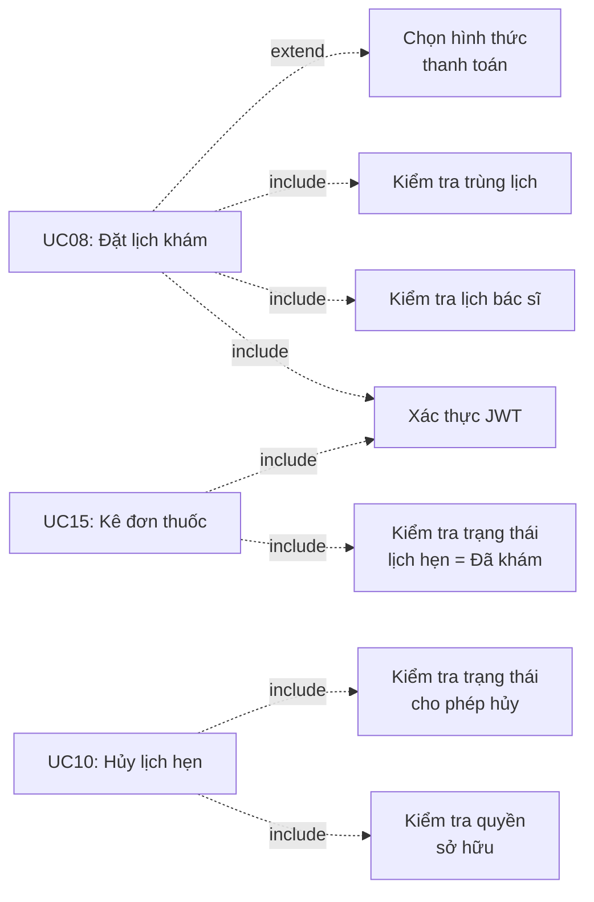

---

## 6. Đặc tả Use Case chi tiết

### UC08: Đặt lịch khám

| Mục | Nội dung |
|-----|----------|
| **Tên UC** | Đặt lịch khám |
| **Actor** | Bệnh nhân |
| **Mô tả** | Bệnh nhân chọn bác sĩ, ngày, khung giờ để đặt lịch khám |
| **Tiền điều kiện** | Bệnh nhân đã đăng nhập |
| **Hậu điều kiện** | Lịch hẹn được tạo với trạng thái "Chờ xác nhận" |
| **Luồng chính** | 1. Bệnh nhân chọn chuyên khoa → chọn bác sĩ |
| | 2. Hệ thống hiển thị thông tin bác sĩ + lịch trống |
| | 3. Bệnh nhân chọn ngày + khung giờ + lý do + hình thức thanh toán |
| | 4. Hệ thống kiểm tra: bác sĩ có lịch làm việc + không trùng lịch |
| | 5. Hệ thống tạo lịch hẹn (trạng thái = 0) |
| | 6. Thông báo "Đặt lịch thành công" |
| **Luồng ngoại lệ** | 4a. Bác sĩ không có lịch làm việc ngày đó → Thông báo lỗi |
| | 4b. Trùng lịch (unique constraint) → Thông báo "Lịch đã được đặt" (409) |

### UC02: Đăng nhập

| Mục | Nội dung |
|-----|----------|
| **Tên UC** | Đăng nhập |
| **Actor** | Bệnh nhân, Bác sĩ, Admin |
| **Mô tả** | Người dùng đăng nhập bằng email và mật khẩu |
| **Tiền điều kiện** | Người dùng có tài khoản hợp lệ |
| **Hậu điều kiện** | Nhận access token + refresh token, chuyển trang theo vai trò |
| **Luồng chính** | 1. Nhập email + mật khẩu |
| | 2. Hệ thống xác thực (bcrypt compare) |
| | 3. Tạo access token + refresh token |
| | 4. Lưu refresh token vào DB + set cookie HttpOnly |
| | 5. Trả access token + thông tin user |
| | 6. Frontend redirect theo vai trò |
| **Luồng ngoại lệ** | 2a. Email/mật khẩu sai → 401 |
| | 2b. Tài khoản bị khóa → 403 |

### UC15: Kê đơn thuốc

| Mục | Nội dung |
|-----|----------|
| **Tên UC** | Kê đơn thuốc |
| **Actor** | Bác sĩ |
| **Mô tả** | Bác sĩ kê đơn thuốc cho lịch hẹn đã khám xong |
| **Tiền điều kiện** | Lịch hẹn có trạng thái = 2 (Đã khám), chưa có đơn thuốc |
| **Hậu điều kiện** | Đơn thuốc được tạo, bệnh nhân có thể xem |
| **Luồng chính** | 1. Bác sĩ chọn lịch hẹn đã khám |
| | 2. Hệ thống kiểm tra trạng thái + chưa có đơn |
| | 3. Bác sĩ nhập thông tin đơn thuốc |
| | 4. Hệ thống lưu đơn thuốc (DonThuoc) |
| **Luồng ngoại lệ** | 2a. Trạng thái chưa phải "Đã khám" → Từ chối |
| | 2b. Đã có đơn thuốc (datLichId unique) → Từ chối |

---

## 7. Biểu đồ hoạt động (Activity Diagram)

### 7.1 Luồng đăng nhập

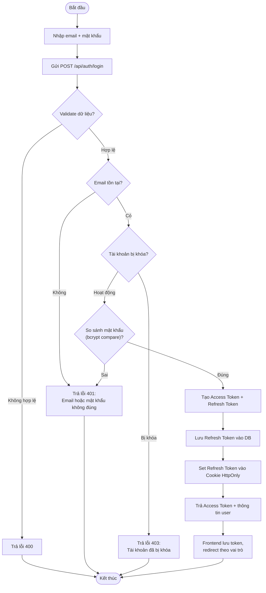

### 7.2 Luồng đặt lịch khám

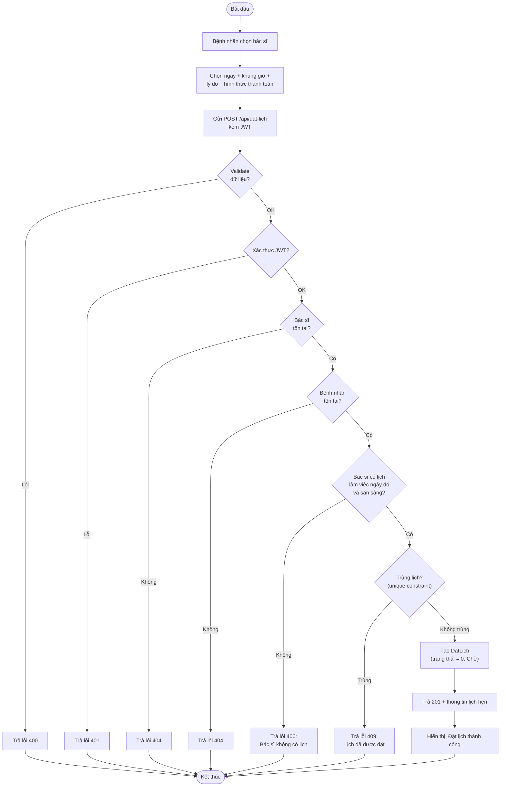

### 7.3 Luồng cập nhật trạng thái lịch hẹn

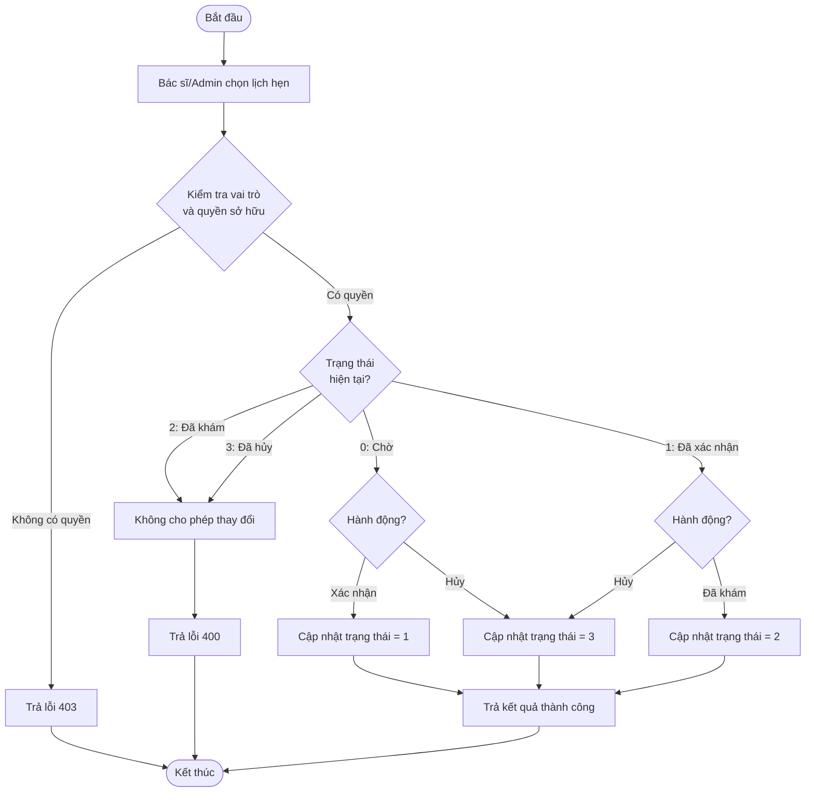

---

## 8. Biểu đồ tuần tự (Sequence Diagram)

### 8.1 Đăng nhập

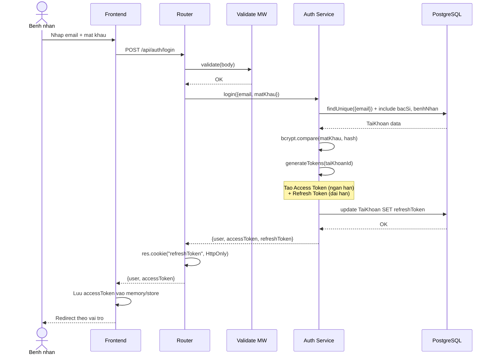

### 8.2 Đặt lịch khám

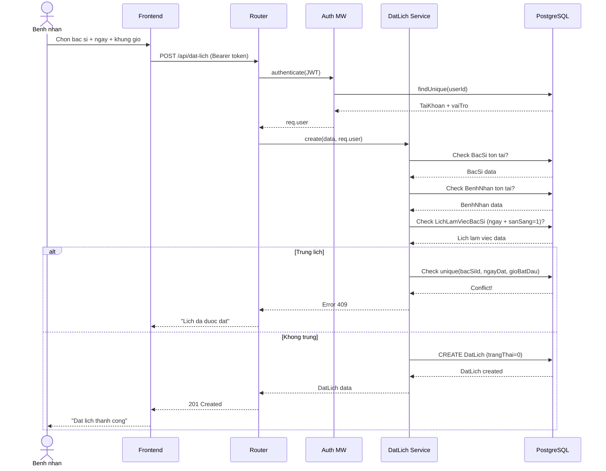

### 8.3 Refresh Token (Token Rotation)

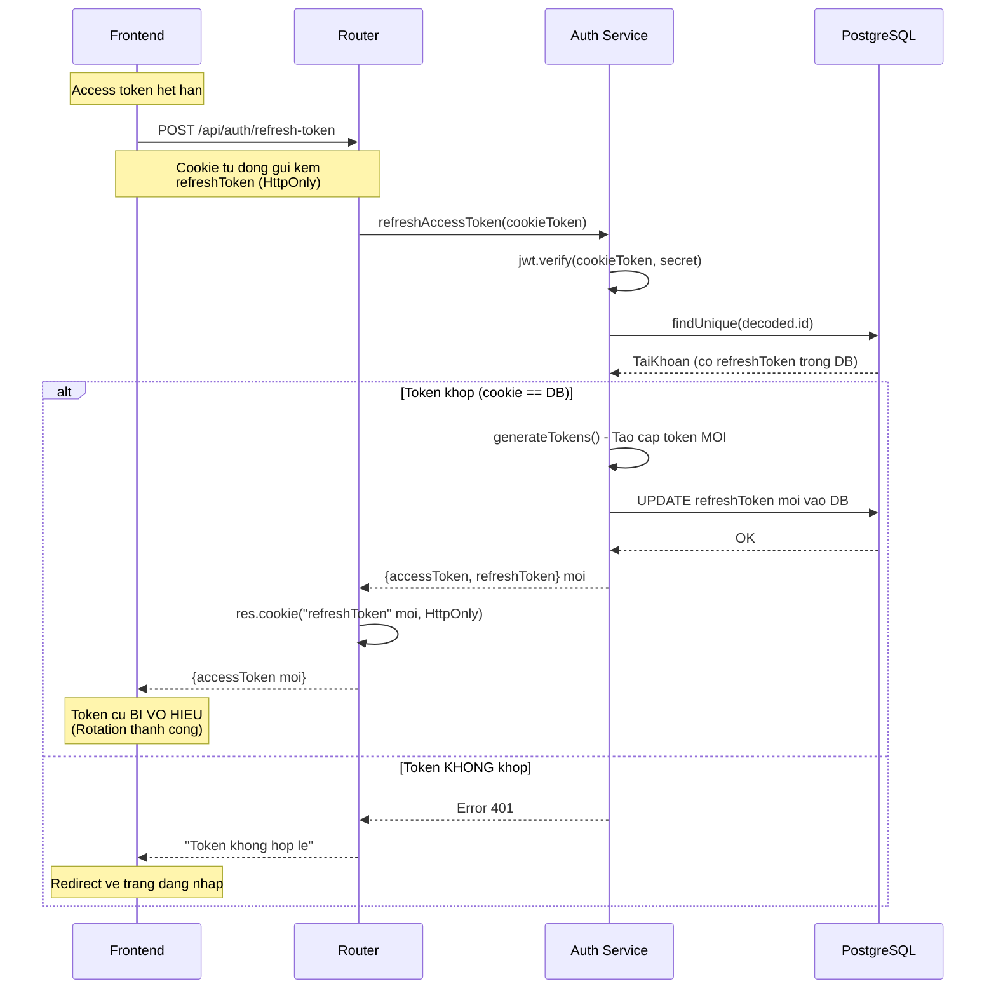

---

## 9. Biểu đồ trạng thái (State Diagram)

### 9.1 Trạng thái lịch hẹn (DatLich.trangThai)

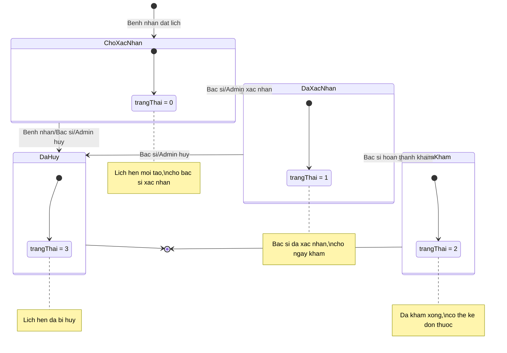

### 9.2 Trạng thái tài khoản (TaiKhoan.trangThaiTaiKhoan)

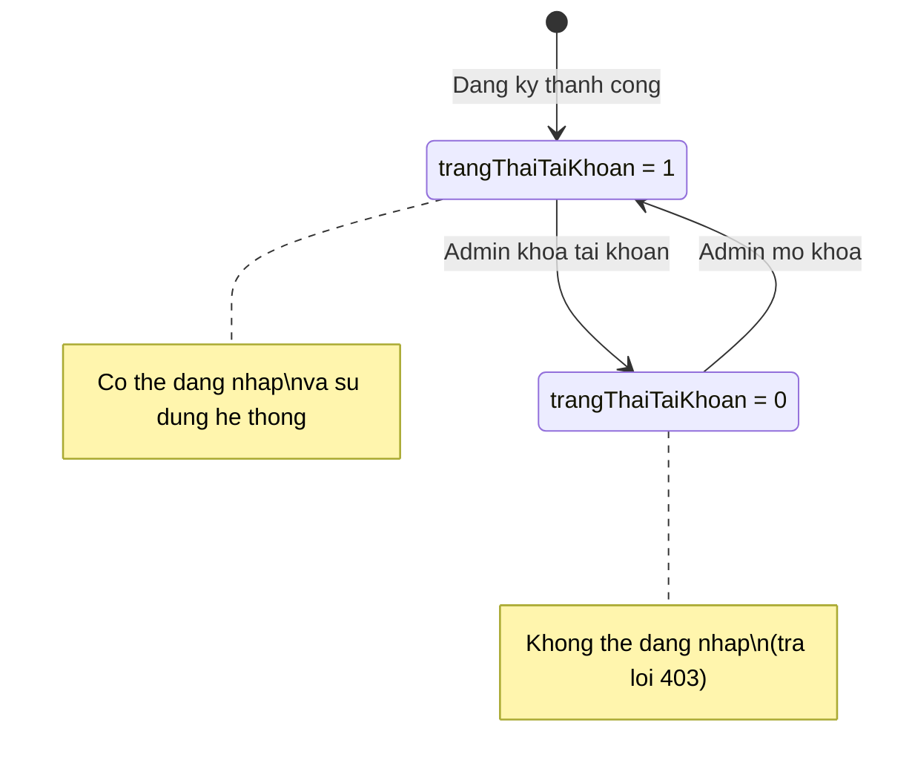

---

## 10. Thiết kế cơ sở dữ liệu

### 10.1 Biểu đồ ERD (Entity Relationship Diagram)

```mermaid
erDiagram
    TaiKhoan ||--o| BacSi : "1-1"
    TaiKhoan ||--o| BenhNhan : "1-1"
    ChuyenKhoa ||--o{ BacSi : "1-N"
    BacSi ||--o{ LichLamViecBacSi : "1-N"
    KhungGio ||--o{ LichLamViecBacSi : "1-N"
    BacSi ||--o{ DatLich : "1-N"
    BenhNhan ||--o{ DatLich : "1-N"
    LichLamViecBacSi ||--o{ DatLich : "1-N"
    HinhThucThanhToan ||--o{ DatLich : "1-N"
    DatLich ||--o| DonThuoc : "1-0..1"
    DatLich ||--o{ GiaoDich : "1-N"
    DonThuoc ||--o{ ChiTietDonThuoc : "1-N"

    TaiKhoan {
        BigInt id PK
        String email UK
        String matKhau
        String vaiTro "admin | bac_si | benh_nhan"
        Int trangThaiTaiKhoan "1=hoat dong, 0=khoa"
        String refreshToken
        Int gioiTinh "1=Nam, 2=Nu, 3=Khac"
        Date ngaySinh
        String diaChi
        String anhDaiDien
        DateTime ngayTao
        DateTime ngayCapNhat
    }

    ChuyenKhoa {
        BigInt id PK
        String tenChuyenKhoa
        String anhChuyenKhoa
        Text moTaChuyenKhoa
        Int thoiLuongKham
        String icon
    }

    BacSi {
        BigInt id PK
        String hocViChucDanh
        String tenBacSi
        String moTaNgan
        Text moTaChiTiet
        Decimal giaKham
        BigInt taiKhoanId FK-UK
        BigInt chuyenKhoaId FK
    }

    BenhNhan {
        BigInt id PK
        String hoTen
        String soDienThoai
        String emailLienHe
        BigInt taiKhoanId FK-UK
    }

    KhungGio {
        BigInt id PK
        Time gioBatDau
        Time gioKetThuc
    }

    LichLamViecBacSi {
        BigInt id PK
        Date ngayLamViec
        Int soBenhNhanHienTai
        Int soBenhNhanToiDa
        Int sanSang
        BigInt bacSiId FK
        BigInt khungGioId FK
    }

    HinhThucThanhToan {
        BigInt id PK
        String tenHinhThuc
        String maLoai "OFFLINE | VNPAY"
    }

    DatLich {
        BigInt id PK
        Date ngayDat
        Time gioBatDau
        Time gioKetThuc
        String lyDoKham
        Decimal giaKham
        Int trangThai "0=cho, 1=xac nhan, 2=da kham, 3=huy"
        Int trangThaiThanhToan "0=chua, 1=phi kham, 2=toan Bo"
        BigInt bacSiId FK
        BigInt benhNhanId FK
        BigInt hinhThucThanhToanId FK
        BigInt lichLamViecId FK
    }

    GiaoDich {
        BigInt id PK
        BigInt datLichId FK
        String loaiGiaoDich "PHI_KHAM | DON_THUOC"
        Decimal soTien
        String maGiaoDichVNP
        String maThamChieu
        Int trangThai "0=cho, 1=thanh cong, 2=that bai"
        DateTime ngayTao
    }

    DonThuoc {
        BigInt id PK
        BigInt datLichId FK-UK
        String chanDoan
        String ghiChu
        Decimal tongTien
        DateTime ngayTao
    }

    ChiTietDonThuoc {
        BigInt id PK
        BigInt donThuocId FK
        String tenThuoc
        Int soLuong
        Decimal donGia
        String lieuDung
        String ghiChu
    }

    CauHoiThuongGap {
        BigInt id PK
        String cauHoi
        Text traLoi
        Int dangHoatDong
    }
```

### 10.2 Ràng buộc nghiệp vụ quan trọng

| Ràng buộc | Bảng | Mô tả |
|-----------|------|-------|
| **Unique constraint** | `DatLich` | `UNIQUE(bacSiId, ngayDat, gioBatDau)` — 1 bác sĩ không thể có 2 lịch hẹn cùng ngày cùng giờ |
| **Unique FK** | `DonThuoc` | `datLichId UNIQUE` — 1 lịch hẹn chỉ có tối đa 1 đơn thuốc |
| **Unique FK** | `BacSi` | `taiKhoanId UNIQUE` — 1 tài khoản chỉ liên kết 1 bác sĩ |
| **Unique FK** | `BenhNhan` | `taiKhoanId UNIQUE` — 1 tài khoản chỉ liên kết 1 bệnh nhân |
| **Default value** | `DatLich` | `trangThai = 0` khi tạo mới (Chờ xác nhận) |
| **Default value** | `LichLamViecBacSi` | `sanSang = 1`, `soBenhNhanHienTai = 0` |
| **Default value** | `TaiKhoan` | `trangThaiTaiKhoan = 1` (Hoạt động) |

---

## 11. Thiết kế API

### 11.1 Tổng quan API Endpoints

Tất cả API đều có prefix `/api` và trả về JSON thống nhất:

```json
{
  "success": true,
  "message": "Thao tac thanh cong",
  "data": { ... }
}
```

### 11.2 Chi tiết Endpoints

#### Auth (`/api/auth`)

| Method | Endpoint | Mô tả | Auth |
|--------|----------|-------|------|
| POST | `/register` | Đăng ký tài khoản bệnh nhân | Không |
| POST | `/login` | Đăng nhập | Không |
| POST | `/refresh-token` | Làm mới access token | Cookie |
| POST | `/logout` | Đăng xuất | JWT |
| GET | `/me` | Xem thông tin tài khoản | JWT |
| PUT | `/doi-mat-khau` | Đổi mật khẩu | JWT |
| PUT | `/cap-nhat-ho-so` | Cập nhật hồ sơ | JWT |

#### Chuyên khoa (`/api/chuyen-khoa`)

| Method | Endpoint | Mô tả | Auth |
|--------|----------|-------|------|
| GET | `/` | Danh sách chuyên khoa | Không |
| GET | `/:id` | Chi tiết chuyên khoa | Không |
| POST | `/` | Tạo chuyên khoa | Admin |
| PUT | `/:id` | Sửa chuyên khoa | Admin |
| DELETE | `/:id` | Xóa chuyên khoa | Admin |

#### Bác sĩ (`/api/bac-si`)

| Method | Endpoint | Mô tả | Auth |
|--------|----------|-------|------|
| GET | `/` | Danh sách bác sĩ | Không |
| GET | `/:id` | Chi tiết bác sĩ | Không |
| POST | `/` | Tạo bác sĩ | Admin |
| PUT | `/:id` | Sửa bác sĩ | Admin |
| DELETE | `/:id` | Xóa bác sĩ | Admin |

#### Đặt lịch (`/api/dat-lich`)

| Method | Endpoint | Mô tả | Auth |
|--------|----------|-------|------|
| GET | `/` | Danh sách lịch hẹn (theo vai trò) | JWT |
| GET | `/:id` | Chi tiết lịch hẹn | JWT |
| POST | `/` | Tạo lịch hẹn | Bệnh nhân |
| PUT | `/:id/trang-thai` | Cập nhật trạng thái | Bác sĩ/Admin |
| DELETE | `/:id` | Hủy lịch hẹn | Bệnh nhân |

#### Lịch làm việc (`/api/lich-lam-viec`)

| Method | Endpoint | Mô tả | Auth |
|--------|----------|-------|------|
| GET | `/` | Lịch làm việc (theo bác sĩ) | JWT |
| POST | `/` | Tạo lịch làm việc | Bác sĩ |
| PUT | `/:id` | Cập nhật lịch làm việc | Bác sĩ |
| DELETE | `/:id` | Xóa lịch làm việc | Bác sĩ |

#### Đơn thuốc (`/api/don-thuoc`)

| Method | Endpoint | Mô tả | Auth |
|--------|----------|-------|------|
| GET | `/:datLichId` | Xem đơn thuốc theo lịch hẹn | JWT |
| POST | `/` | Tạo đơn thuốc | Bác sĩ |

#### Thống kê (`/api/thong-ke`)

| Method | Endpoint | Mô tả | Auth |
|--------|----------|-------|------|
| GET | `/tong-quan` | Thống kê số lượng (BN, BS), doanh thu 2 loại phí, tỉ lệ | Admin |
| GET | `/lich-hen` | Thống kê lịch hẹn theo ngày, top bác sĩ | Admin |
| GET | `/doanh-thu` | Thống kê doanh thu theo 12 tháng | Admin |

#### Thanh toán VNPay (`/api/vnpay`)

| Method | Endpoint | Mô tả | Auth |
|--------|----------|-------|------|
| POST | `/create_payment_url` | Tạo link thanh toán VNPay | Bệnh nhân |
| GET | `/vnpay_return` | Xử lý kết quả trả về từ VNPay (Redirect) | Không |
| GET | `/vnpay_ipn` | Xử lý kết quả IPN (Server-to-Server) | Không |

---

## 12. Thiết kế bảo mật

### 12.1 Cơ chế xác thực JWT kép (Dual JWT + Token Rotation)

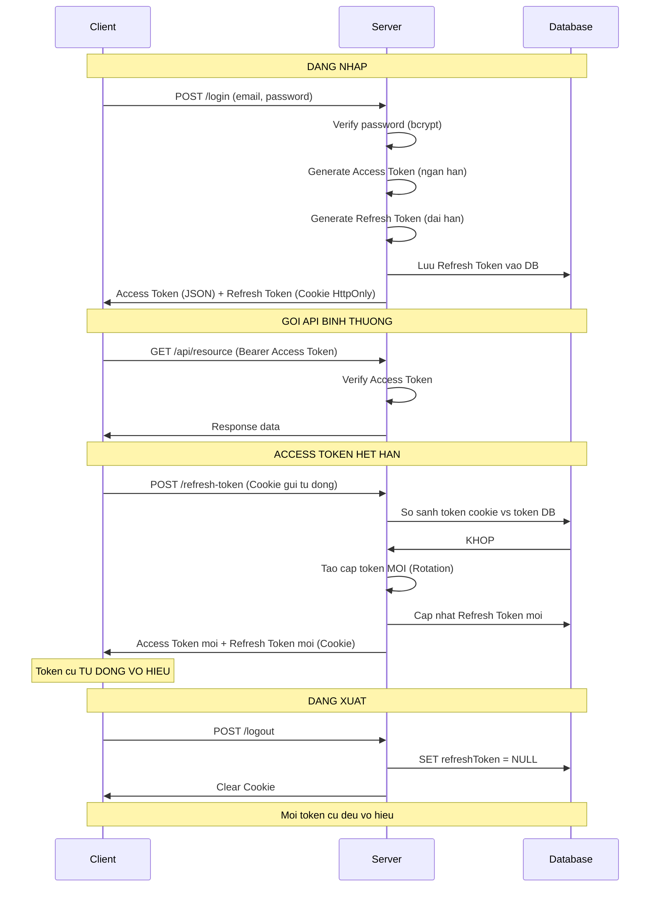

### 12.2 Phân quyền theo vai trò

| Tầng | Cơ chế | Mô tả |
|------|--------|-------|
| **Authentication** | `authenticate` middleware | Verify JWT, gắn `req.user` |
| **Authorization** | `authorize(...roles)` middleware | Kiểm tra vai trò (`admin`, `bac_si`, `benh_nhan`) |
| **Ownership** | Logic trong Service | Kiểm tra `benhNhanId` / `bacSiId` khớp với user đang đăng nhập |

### 12.3 Các biện pháp bảo mật

| Biện pháp | Cách triển khai |
|-----------|-----------------|
| Hash mật khẩu | `bcryptjs` với salt rounds = 10 |
| Refresh token trong cookie | `HttpOnly`, `Secure` (production), `SameSite: strict` |
| Token Rotation | Refresh token mới sau mỗi lần refresh, token cũ vô hiệu |
| CORS | Chỉ cho phép origin từ CLIENT_URL |
| Validate đầu vào | `express-validator` trước khi vào controller |
| Error handling | Middleware tập trung, không lộ stack trace ở production |

---

## 13. Kết luận

Qua quá trình phân tích và thiết kế, hệ thống website đặt lịch khám bệnh trực tuyến **ClinicBooking** được xây dựng theo kiến trúc **3 tầng** (Presentation - Application - Data), phân tách rõ ràng trách nhiệm từng tầng.

**Các điểm nổi bật trong thiết kế:**

- **12 bảng dữ liệu** với quan hệ chặt chẽ và ràng buộc nghiệp vụ đầy đủ (unique constraint chống trùng lịch, ownership check).
- **Tích hợp VNPay**: Hỗ trợ thanh toán phí khám và tiền thuốc trực tuyến an toàn.
- **Cơ chế bảo mật JWT kép** với Refresh Token Rotation — đảm bảo an toàn phiên đăng nhập.
- **Phân quyền 3 cấp**: Authentication → Authorization → Ownership check.
- **10+ module API RESTful** với kiến trúc Controller → Service → Prisma → Database.
- **Luồng nghiệp vụ** được mô tả rõ qua biểu đồ Use Case, Activity, Sequence và State.

Hệ thống đáp ứng các yêu cầu chức năng (đặt lịch, thanh toán, quản lý lịch, kê đơn, thống kê) và phi chức năng (bảo mật, hiệu năng, khả dụng) phù hợp với quy mô một phòng khám vừa và nhỏ.

---

> 📝 *Tài liệu phân tích thiết kế hệ thống — Đồ án tốt nghiệp*
> *Trường Đại học Mỏ - Địa Chất Hà Nội*
