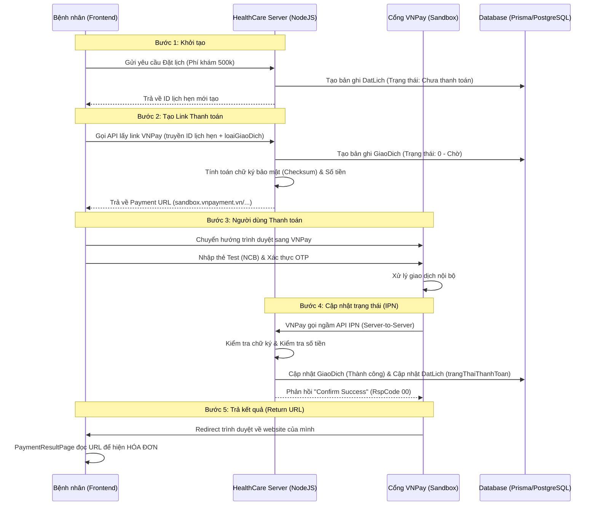

# 🛡️ Tài liệu Luồng Giao dịch VNPay - HealthCare Project

Tài liệu này giải thích cách hệ thống HealthCare tương tác với cổng thanh toán VNPay để xử lý việc đặt lịch khám và thanh toán online.

---

## 1. Sơ đồ Luồng (Sequence Diagram)

---

## 2. Giải thích chi tiết các thành phần

### A. BookingPage.jsx (Cửa ngõ ra)
*   **Vị trí**: `client/src/pages/patient/BookingPage.jsx`
*   **Nhiệm vụ**: Sau khi Backend báo "Đặt lịch thành công", nếu người dùng chọn VNPay, file này sẽ gọi API nạp tiền và dùng `window.location.href` để chuyển bạn đi.

### B. vnpay.service.js (Bộ não xử lý)
*   **Vị trí**: `server/src/services/vnpay.service.js`
*   **Nhiệm vụ**: 
    - Lấy thông tin giá từ bảng `DatLich`.
    - Làm sạch nội dung (`sanitizeOrderInfo`) để tránh lỗi ký tự đặc biệt.
    - Tạo `vnp_TxnRef` (Mã tham chiều) duy nhất để VNPay gửi lại cho mình.
    - Xử lý xác thực IPN (bước quan trọng nhất để nạp tiền vào DB).

### C. PaymentResultPage.jsx (Cửa ngõ vào)
*   **Vị trí**: `client/src/pages/patient/PaymentResultPage.jsx`
*   **Nhiệm vụ**: Đón người dùng quay lại. Nó lấy `vnp_ResponseCode` từ URL:
    - Nếu là `00`: Hiện banner xanh (Thành công).
    - Nếu khác `00`: Hiện banner đỏ (Thất bại).

### D. Model GiaoDich (Lưu trữ lịch sử)
*   **Vị trí**: `server/prisma/schema.prisma` -> `model GiaoDich`
*   **Nhiệm vụ**: Lưu lại mọi nỗ lực thanh toán của người dùng, bao gồm mã tham chiếu VNP, số tiền, loại giao dịch (Phí khám/Thuốc) và trạng thái cuối cùng giúp đối soát dữ liệu dễ dàng.

---

## 3. Các tham số cần ghi nhớ (Dành cho Báo cáo)

| Tham số | Ý nghĩa | Ghi chú |
|:--- |:--- |:--- |
| **vnp_Amount** | Số tiền | Gửi đi là VND, VNPay tự nạp thêm 00 ở cuối (cents). |
| **vnp_TxnRef** | Mã tham chiếu | Phải là duy nhất cho mỗi lần nhấn nút thanh toán. |
| **vnp_ResponseCode** | Mã kết quả | `00` là con số "vàng" (Thành công). |
| **vnp_SecureHash** | Chữ ký bảo mật | Giúp VNPay và Web của bạn hiểu nhau mà không bị hacker can thiệp. |

---

> [!TIP]
> **Điểm mấu chốt**: Hệ thống cập nhật tiền vào Database thông qua bước **IPN** (VNPay gọi trực tiếp cho Server của mình), chứ không phải dựa vào trang Kết quả mà người dùng thấy. Điều này giúp ngăn chặn việc người dùng "giả mạo" link thành công để hack tiền.

---
*Tài liệu được tạo tự động bởi Antigravity trợ lý AI.*
