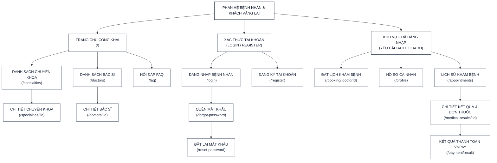
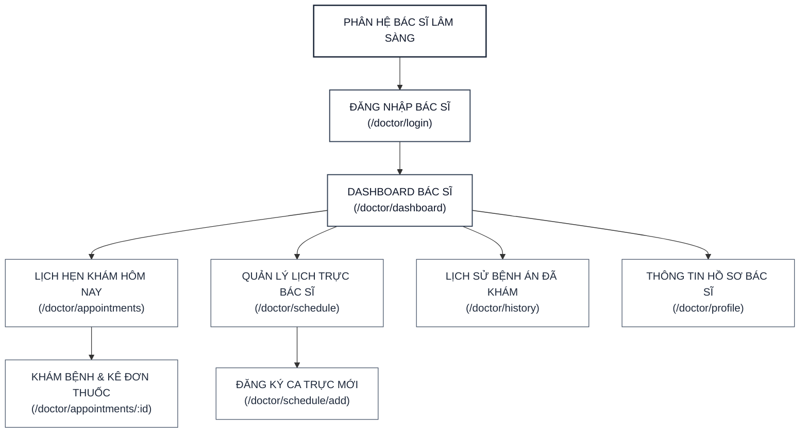

# 🗺️ SƠ ĐỒ ĐIỀU HƯỚNG TRANG TOÀN HỆ THỐNG (DOC_17)
> **HealthCare Project — Sơ đồ Cấu trúc & Điều hướng toàn bộ hệ thống phòng khám**
>
> Tài liệu này mô tả sơ đồ phân trang toàn hệ thống và sơ đồ phân trang chi tiết của từng phân hệ. Toàn bộ sơ đồ đã được chuẩn hóa 100% theo các Route vật lý thực tế trong code (`client/src/router/index.js`), loại bỏ hoàn toàn các nhóm trung gian không có trong code (như "Cấu hình hệ thống", "Quản lý người dùng") để tránh gây hiểu nhầm cho Hội đồng chấm đồ án.

---

## 💡 CÁCH TRÌNH BÀY SƠ ĐỒ VÀO WORD ĐẸP NHẤT

### 🛠️ CÁCH 1: Vẽ bằng Shape/SmartArt trong Word hoặc PowerPoint (KHUYÊN DÙNG)
Dưới đây là **cây thư mục phân cấp vật lý (Text Hierarchy Outline)** chuẩn xác 100% của toàn bộ hệ thống phòng khám. Tất cả các trang quản lý của Admin đều được nối trực tiếp từ Dashboard Admin giống như giao diện thanh Sidebar thực tế:

```text
HỆ THỐNG WEBSITE PHÒNG KHÁM HEALTHCARE
├── BỆNH NHÂN — CHƯA ĐĂNG NHẬP (KHÁCH VÃNG LAI - publicRoutes)
│   ├── TRANG CHỦ BỆNH NHÂN (/)
│   │   ├── DANH SÁCH CHUYÊN KHOA (/specialties)
│   │   │   └── CHI TIẾT CHUYÊN KHOA (/specialties/:id)
│   │   ├── DANH SÁCH BÁC SĨ (/doctors)
│   │   │   └── CHI TIẾT BÁC SĨ (/doctors/:id)
│   │   └── HỎI ĐÁP FAQ (/faq)
│   └── XÁC THỰC TÀI KHOẢN
│       ├── ĐĂNG NHẬP BỆNH NHÂN (/login)
│       │   └── QUÊN MẬT KHẨU (/forgot-password)
│       │       └── ĐẶT LẠI MẬT KHẨU (/reset-password)
│       └── ĐĂNG KÝ BỆNH NHÂN (/register)
│
├── BỆNH NHÂN — ĐÃ ĐĂNG NHẬP (YÊU CẦU AUTH GUARD - privateRoutes)
│   ├── ĐẶT LỊCH KHÁM BỆNH (/booking/:doctorId)
│   ├── HỒ SƠ CÁ NHÂN BỆNH NHÂN (/profile)
│   └── LỊCH SỬ KHÁM BỆNH (/appointments)
│       └── CHI TIẾT KẾT QUẢ & ĐƠN THUỐC (/medical-results/:id)
│           └── KẾT QUẢ THANH TOÁN HÓA ĐƠN VNPAY (/payment/result)
│
├── ĐĂNG NHẬP BÁC SĨ (/doctor/login)
│   └── DASHBOARD BÁC SĨ (/doctor/dashboard)
│       ├── LỊCH HẸN KHÁM HÔM NAY (/doctor/appointments)
│       │   └── KHÁM BỆNH & KÊ ĐƠN THUỐC (/doctor/appointments/:id)
│       ├── QUẢN LÝ LỊCH TRỰC (/doctor/schedule)
│       │   └── ĐĂNG KÝ CA TRỰC MỚI (/doctor/schedule/add)
│       ├── LỊCH SỬ BỆNH ÁN ĐÃ KHÁM (/doctor/history)
│       └── THÔNG TIN HỒ SƠ BÁC SĨ (/doctor/profile)
│
└── ĐĂNG NHẬP ADMIN (/login)
    └── DASHBOARD ADMIN (/admin/dashboard)
        ├── QUẢN LÝ BÁC SĨ (/admin/doctors)
        │   ├── THÊM BÁC SĨ MỚI (/admin/doctors/add)
        │   └── SỬA HỒ SƠ BÁC SĨ (/admin/doctors/edit/:id)
        ├── QUẢN LÝ BỆNH NHÂN (/admin/patients)
        │   └── CHI TIẾT BỆNH NHÂN (/admin/patients/:id)
        ├── QUẢN LÝ CHUYÊN KHOA (/admin/specialties)
        │   └── THÊM CHUYÊN KHOA MỚI (/admin/specialties/add)
        ├── QUẢN LÝ LỊCH HẸN (/admin/appointments)
        │   └── CHI TIẾT LỊCH HẸN (/admin/appointments/:id)
        ├── QUẢN LÝ LỊCH TRỰC HỆ THỐNG (/admin/schedules)
        ├── QUẢN LÝ KHUNG GIỜ KHÁM (/admin/time-slots)
        ├── QUẢN LÝ PHƯƠNG THỨC THANH TOÁN (/admin/payment-methods)
        ├── THỐNG KÊ DOANH THU BIỂU ĐỒ (/admin/stats)
        └── QUẢN LÝ NỘI DUNG FAQ (/admin/faqs)
            └── THÊM MỚI CÂU HỎI FAQ (/admin/faqs/add)
```

---

### 🎨 CÁCH 2: Dùng Sơ đồ Dòng chảy Ngang (graph LR) của Mermaid
*Sơ đồ chảy từ Trái sang Phải này hiển thị rất to, rõ nét trong Word. Toàn bộ các liên kết trung gian không có trong code đã được lược bỏ để kết nối trực tiếp vào các Dashboard.*

```mermaid
graph LR
    SysRoot["HỆ THỐNG WEBSITE HEALTHCARE"] --> ColPatPublic["BỆNH NHÂN - CHƯA ĐĂNG NHẬP<br>(publicRoutes)"]
    SysRoot --> ColPatPrivate["BỆNH NHÂN - ĐÃ ĐĂNG NHẬP<br>(privateRoutes)"]
    SysRoot --> ColDoc["ĐĂNG NHẬP BÁC SĨ (/doctor/login)"]
    SysRoot --> ColAdm["ĐĂNG NHẬP ADMIN (/login)"]

    %% --- BỆNH NHÂN CHƯA ĐĂNG NHẬP ---
    ColPatPublic --> PatHome["Trang chủ (/)"]
    PatHome --> PatSpec["Danh sách Chuyên khoa (/specialties)"]
    PatSpec --> PatSpecDetail["Chi tiết Chuyên khoa (/specialties/:id)"]
    PatHome --> PatDoc["Danh sách Bác sĩ (/doctors)"]
    PatDoc --> PatDocDetail["Chi tiết Bác sĩ (/doctors/:id)"]
    PatHome --> PatFAQ["Hỏi đáp FAQ (/faq)"]
    ColPatPublic --> PatAuth["Xác thực tài khoản"]
    PatAuth --> PatLogin["Đăng nhập (/login)"]
    PatLogin --> PatForgot["Quên mật khẩu (/forgot-password)"]
    PatAuth --> PatRegister["Đăng ký (/register)"]

    %% --- BỆNH NHÂN ĐÃ ĐĂNG NHẬP ---
    ColPatPrivate --> PatBooking["Đặt lịch khám (/booking/:doctorId)"]
    ColPatPrivate --> PatProfile["Hồ sơ cá nhân (/profile)"]
    ColPatPrivate --> PatHistory["Lịch sử khám bệnh (/appointments)"]
    PatHistory --> PatResult["Kết quả & Đơn thuốc (/medical-results/:id)"]
    PatResult --> PatPay["Thanh toán VNPay (/payment/result)"]

    %% --- PHÂN HỆ BÁC SĨ ---
    ColDoc --> DocDash["Dashboard Bác sĩ (/doctor/dashboard)"]
    DocDash --> DocAppt["Lịch hẹn khám hôm nay (/doctor/appointments)"]
    DocAppt --> DocPrescribe["Chi tiết ca khám & Kê đơn (/doctor/appointments/:id)"]
    DocDash --> DocSched["Quản lý ca trực (/doctor/schedule)"]
    DocSched --> DocAddSched["Đăng ký ca trực mới (/doctor/schedule/add)"]
    DocDash --> DocHistory["Lịch sử bệnh án đã khám (/doctor/history)"]
    DocDash --> DocProfile["Hồ sơ cá nhân Bác sĩ (/doctor/profile)"]

    %% --- PHÂN HỆ ADMIN ---
    ColAdm --> AdmDash["Dashboard Admin (/admin/dashboard)"]
    AdmDash --> AdmDoc["Quản lý Bác sĩ (/admin/doctors)"]
    AdmDoc --> AdmAddDoc["Thêm Bác sĩ mới (/admin/doctors/add)"]
    AdmDoc --> AdmEditDoc["Sửa hồ sơ Bác sĩ (/admin/doctors/edit/:id)"]
    
    AdmDash --> AdmPat["Quản lý Bệnh nhân (/admin/patients)"]
    AdmPat --> AdmPatDetail["Chi tiết Bệnh nhân (/admin/patients/:id)"]
    
    AdmDash --> AdmSpec["Quản lý Chuyên khoa (/admin/specialties)"]
    AdmSpec --> AdmAddSpec["Thêm Chuyên khoa mới (/admin/specialties/add)"]
    
    AdmDash --> AdmAppt["Quản lý Lịch hẹn (/admin/appointments)"]
    AdmAppt --> AdmApptDetail["Chi tiết Lịch hẹn (/admin/appointments/:id)"]
    
    AdmDash --> AdmSched["Quản lý Lịch trực hệ thống (/admin/schedules)"]
    AdmDash --> AdmTime["Quản lý Khung giờ (/admin/time-slots)"]
    AdmDash --> AdmPay["Quản lý Thanh toán (/admin/payment-methods)"]
    AdmDash --> AdmStats["Thống kê doanh thu (/admin/stats)"]
    
    AdmDash --> AdmFAQ["Quản lý FAQ (/admin/faqs)"]
    AdmFAQ --> AdmAddFAQ["Thêm mới FAQ (/admin/faqs/add)"]

    %% Styling tối giản
    style SysRoot fill:#ffffff,stroke:#0f172a,stroke-width:2px,color:#0f172a;
    style ColPatPublic fill:#ffffff,stroke:#1e293b,stroke-width:1.5px,color:#0f172a;
    style ColPatPrivate fill:#ffffff,stroke:#1e293b,stroke-width:1.5px,color:#0f172a;
    style ColDoc fill:#ffffff,stroke:#1e293b,stroke-width:1.5px,color:#0f172a;
    style ColAdm fill:#ffffff,stroke:#1e293b,stroke-width:1.5px,color:#0f172a;
    
    style PatHome fill:#ffffff,stroke:#475569,stroke-width:1px,color:#1e293b;
    style PatSpec fill:#ffffff,stroke:#475569,stroke-width:1px,color:#1e293b;
    style PatSpecDetail fill:#ffffff,stroke:#475569,stroke-width:1px,color:#1e293b;
    style PatDoc fill:#ffffff,stroke:#475569,stroke-width:1px,color:#1e293b;
    style PatDocDetail fill:#ffffff,stroke:#475569,stroke-width:1px,color:#1e293b;
    style PatFAQ fill:#ffffff,stroke:#475569,stroke-width:1px,color:#1e293b;
    style PatAuth fill:#ffffff,stroke:#475569,stroke-width:1px,color:#1e293b;
    style PatLogin fill:#ffffff,stroke:#475569,stroke-width:1px,color:#1e293b;
    style PatForgot fill:#ffffff,stroke:#475569,stroke-width:1px,color:#1e293b;
    style PatRegister fill:#ffffff,stroke:#475569,stroke-width:1px,color:#1e293b;

    style PatBooking fill:#ffffff,stroke:#475569,stroke-width:1px,color:#1e293b;
    style PatProfile fill:#ffffff,stroke:#475569,stroke-width:1px,color:#1e293b;
    style PatHistory fill:#ffffff,stroke:#475569,stroke-width:1px,color:#1e293b;
    style PatResult fill:#ffffff,stroke:#475569,stroke-width:1px,color:#1e293b;
    style PatPay fill:#ffffff,stroke:#475569,stroke-width:1px,color:#1e293b;

    style DocDash fill:#ffffff,stroke:#475569,stroke-width:1.5px,color:#1e293b;
    style DocAppt fill:#ffffff,stroke:#475569,stroke-width:1px,color:#1e293b;
    style DocPrescribe fill:#ffffff,stroke:#475569,stroke-width:1px,color:#1e293b;
    style DocSched fill:#ffffff,stroke:#475569,stroke-width:1px,color:#1e293b;
    style DocAddSched fill:#ffffff,stroke:#475569,stroke-width:1px,color:#1e293b;
    style DocHistory fill:#ffffff,stroke:#475569,stroke-width:1px,color:#1e293b;
    style DocProfile fill:#ffffff,stroke:#475569,stroke-width:1px,color:#1e293b;

    style AdmDash fill:#ffffff,stroke:#475569,stroke-width:1.5px,color:#1e293b;
    style AdmDoc fill:#ffffff,stroke:#475569,stroke-width:1px,color:#1e293b;
    style AdmAddDoc fill:#ffffff,stroke:#475569,stroke-width:1px,color:#1e293b;
    style AdmEditDoc fill:#ffffff,stroke:#475569,stroke-width:1px,color:#1e293b;
    style AdmPat fill:#ffffff,stroke:#475569,stroke-width:1px,color:#1e293b;
    style AdmPatDetail fill:#ffffff,stroke:#475569,stroke-width:1px,color:#1e293b;
    style AdmSpec fill:#ffffff,stroke:#475569,stroke-width:1px,color:#1e293b;
    style AdmAddSpec fill:#ffffff,stroke:#475569,stroke-width:1px,color:#1e293b;
    style AdmAppt fill:#ffffff,stroke:#475569,stroke-width:1px,color:#1e293b;
    style AdmApptDetail fill:#ffffff,stroke:#475569,stroke-width:1px,color:#1e293b;
    style AdmSched fill:#ffffff,stroke:#475569,stroke-width:1px,color:#1e293b;
    style AdmTime fill:#ffffff,stroke:#475569,stroke-width:1px,color:#1e293b;
    style AdmPay fill:#ffffff,stroke:#475569,stroke-width:1px,color:#1e293b;
    style AdmStats fill:#ffffff,stroke:#475569,stroke-width:1px,color:#1e293b;
    style AdmFAQ fill:#ffffff,stroke:#475569,stroke-width:1px,color:#1e293b;
    style AdmAddFAQ fill:#ffffff,stroke:#475569,stroke-width:1px,color:#1e293b;
```



---

## 🧭 2. SƠ ĐỒ CHI TIẾT PHÂN HỆ BỆNH NHÂN (PATIENT PORTAL)
*Sơ đồ phân rã dọc chi rõ ràng trạng thái Đăng nhập bảo mật.*



---

## 🩺 3. SƠ ĐỒ CHI TIẾT PHÂN HỆ BÁC SĨ (DOCTOR PORTAL)
*Sơ đồ phân cấp dọc cho Bác sĩ, bắt đầu từ cổng đăng nhập.*



---

## 🛡️ 4. SƠ ĐỒ CHI TIẾT PHÂN HỆ QUẢN TRỊ VIÊN (ADMIN PORTAL)
*Sơ đồ phân cấp dọc cho Admin, kết nối từ Dashboard thẳng ra các trang chức năng trên Sidebar thực tế.*

```mermaid
graph TD
    RootAdm["PHÂN HỆ QUẢN TRỊ VIÊN (ADMIN)"] --> ColAdmLogin["ĐĂNG NHẬP ADMIN<br>(/login)"]
    ColAdmLogin --> ColAdmDash["DASHBOARD ADMIN<br>(/admin/dashboard)"]

    %% 9 chức năng trên Sidebar kết nối trực tiếp từ Dashboard
    ColAdmDash --> AdmDoc["QUẢN LÝ BÁC SĨ LÂM SÀNG<br>(/admin/doctors)"]
    ColAdmDash --> AdmPat["QUẢN LÝ BỆNH NHÂN<br>(/admin/patients)"]
    ColAdmDash --> AdmSpec["QUẢN LÝ CHUYÊN KHOA<br>(/admin/specialties)"]
    ColAdmDash --> AdmAppt["QUẢN LÝ LỊCH HẸN KHÁM<br>(/admin/appointments)"]
    ColAdmDash --> AdmSched["QUẢN LÝ LỊCH TRỰC HỆ THỐNG<br>(/admin/schedules)"]
    ColAdmDash --> AdmTime["QUẢN LÝ KHUNG GIỜ KHÁM<br>(/admin/time-slots)"]
    ColAdmDash --> AdmPay["QUẢN LÝ PHƯƠNG THỨC THANH TOÁN<br>(/admin/payment-methods)"]
    ColAdmDash --> AdmStats["THỐNG KÊ DOANH THU BIỂU ĐỒ<br>(/admin/stats)"]
    ColAdmDash --> AdmContent["QUẢN LÝ NỘI DUNG FAQ HỎI ĐÁP<br>(/admin/faqs)"]

    %% Chi tiết cấp 3
    AdmDoc --> AdmAddDoc["THÊM BÁC SĨ MỚI<br>(/admin/doctors/add)"]
    AdmDoc --> AdmEditDoc["SỬA HỒ SƠ BÁC SĨ<br>(/admin/doctors/edit/:id)"]
    
    AdmPat --> AdmPatDetail["CHI TIẾT BỆNH NHÂN<br>(/admin/patients/:id)"]

    AdmSpec --> AdmAddSpec["THÊM CHUYÊN KHOA MỚI<br>(/admin/specialties/add)"]
    
    AdmAppt --> AdmApptDetail["CHI TIẾT LỊCH HẸN KHÁM<br>(/admin/appointments/:id)"]
    
    AdmContent --> AdmAddFAQ["THÊM MỚI CÂU HỎI FAQ<br>(/admin/faqs/add)"]

    %% Styling
    style RootAdm fill:#ffffff,stroke:#1e293b,stroke-width:2px,color:#0f172a;
    style ColAdmLogin fill:#ffffff,stroke:#334155,stroke-width:1.5px,color:#0f172a;
    style ColAdmDash fill:#ffffff,stroke:#334155,stroke-width:1.5px,color:#0f172a;
    
    style AdmDoc fill:#ffffff,stroke:#475569,stroke-width:1px,color:#1e293b;
    style AdmAddDoc fill:#ffffff,stroke:#475569,stroke-width:1px,color:#1e293b;
    style AdmEditDoc fill:#ffffff,stroke:#475569,stroke-width:1px,color:#1e293b;
    style AdmPat fill:#ffffff,stroke:#475569,stroke-width:1px,color:#1e293b;
    style AdmPatDetail fill:#ffffff,stroke:#475569,stroke-width:1px,color:#1e293b;
    style AdmSpec fill:#ffffff,stroke:#475569,stroke-width:1px,color:#1e293b;
    style AdmAddSpec fill:#ffffff,stroke:#475569,stroke-width:1px,color:#1e293b;
    style AdmAppt fill:#ffffff,stroke:#475569,stroke-width:1px,color:#1e293b;
    style AdmApptDetail fill:#ffffff,stroke:#475569,stroke-width:1px,color:#1e293b;
    style AdmSched fill:#ffffff,stroke:#475569,stroke-width:1px,color:#1e293b;
    style AdmTime fill:#ffffff,stroke:#475569,stroke-width:1px,color:#1e293b;
    style AdmPay fill:#ffffff,stroke:#475569,stroke-width:1px,color:#1e293b;
    style AdmStats fill:#ffffff,stroke:#475569,stroke-width:1px,color:#1e293b;
    style AdmContent fill:#ffffff,stroke:#475569,stroke-width:1px,color:#1e293b;
    style AdmAddFAQ fill:#ffffff,stroke:#475569,stroke-width:1px,color:#1e293b;
```



---

## 💡 5. HƯỚNG DẪN TRÌNH BÀY VÀO WORD

1. **Với Sơ đồ 1 (Toàn hệ thống ngang):** Thích hợp đặt tại trang nằm ngang (Landscape) ở phần Phụ lục hoặc phần tổng quan kiến trúc.
2. **Với Sơ đồ 2, 3, 4 (Từng phân hệ độc lập dọc):** Thích hợp chèn trực tiếp vào các chương mô tả chi tiết từng phân hệ của thuyết minh. Vì các sơ đồ này được thiết kế theo chiều dọc, bạn hoàn toàn có thể chèn trực tiếp vào trang dọc (Portrait) A4 thông thường của Word mà không lo bị mất chữ hay nhỏ nét.
