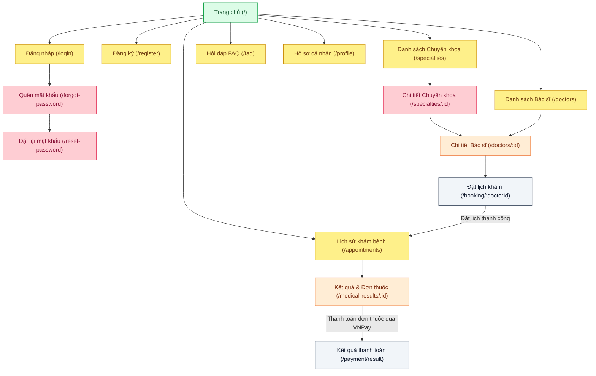

# 🗺️ SƠ ĐỒ ĐIỀU HƯỚNG TRANG - PHÂN HỆ BỆNH NHÂN (DOC_17)
> **HealthCare Project — Sơ đồ Cấu trúc & Điều hướng phân hệ Bệnh nhân**
>
> Tài liệu này mô tả sơ đồ điều hướng (Sitemap) chi tiết của phân hệ Bệnh nhân dựa trên các click chuột thực tế từ Trang chủ đi sâu vào các trang tiếp theo.

---

## 🧭 Sơ Đồ Cây Điều Hướng (Navigation Tree Map)

Sơ đồ thể hiện luồng đi và hành động click chuột thực tế của người dùng:
* **Đặt lịch khám** xong sẽ chuyển hướng bệnh nhân về trang **Lịch sử khám bệnh** để theo dõi trạng thái Chờ xác nhận (không có bước thanh toán tại đây).
* **Thanh toán trực tuyến (VNPay)** chỉ diễn ra sau khi khám xong, bệnh nhân vào xem trang **Kết quả & Đơn thuốc** mới thực hiện thanh toán hóa đơn để mở khóa xem chi tiết đơn thuốc.

---

## 🎨 CHÚ THÍCH PHÂN CẤP MÀU SẮC (LEGEND)

Trong báo cáo, màu sắc của các ô thể hiện **Cấu trúc Kiến trúc Thông tin (Information Architecture)** của website theo mức độ quan trọng và độ sâu của đường dẫn URL:

| Màu Sắc | Phân Cấp Trang | Ý Nghĩa / Cách Người Dùng Tiếp Cận | Ví Dụ |
| :--- | :--- | :--- | :--- |
| 🟩 **Xanh Lá** | **Root (Cấp 0)** | Trang chủ gốc, điểm truy cập đầu tiên của hệ thống. | Trang chủ (`/`) |
| 🟨 **Vàng** | **Trang Cấp 1** | Các trang chính nằm ngay trên Menu Điều hướng (Header Navigation), click được trực tiếp từ Trang chủ. | Đăng nhập, Chuyên khoa, Bác sĩ, Hồ sơ... |
| 🟥 **Hồng** | **Trang Cấp 2** | Các trang phụ hoặc trang danh sách con phát sinh sau Trang cấp 1. | Quên mật khẩu, Chi tiết Chuyên khoa... |
| 🟧 **Cam** | **Trang Cấp 3** | Các trang xem chi tiết thực thể hoặc dữ liệu chuyên sâu. | Chi tiết Bác sĩ, Kết quả khám & Đơn thuốc... |
| ⬜ **Xám** | **Trang Cấp 4 (Action)** | Trang thực hiện hành động/điền form cuối cùng để hoàn tất quy trình nghiệp vụ. | Đặt lịch khám, Kết quả thanh toán VNPay |
