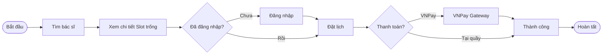

# PHỤ LỤC 03: THIẾT KẾ GIAO DIỆN, USER FLOW VÀ SƠ ĐỒ PHÂN TRANG

> Giai đoạn thực hiện: Tuần 3 (Cấu trúc) & Tuần 6 (Giao diện)
> Nội dung: Kiến trúc thông tin, thiết kế tương tác và luồng trải nghiệm người dùng.

---

## 1. Sơ đồ phân trang (Sitemap)
Hệ thống bao gồm 41 trang được tổ chức thành 3 Portal riêng biệt cho 3 nhóm đối tượng.

```mermaid
graph TD
    Root["🌐 CLINICBOOKING"] --> Patient["👤 PATIENT PORTAL"]
    Root --> Doctor["🩺 DOCTOR PORTAL"]
    Root --> Admin["🛡️ ADMIN PORTAL"]

    subgraph "Portal Bệnh nhân (14 trang)"
        Patient --> P1[Trang chủ]
        Patient --> P2[Đăng ký/Đăng nhập]
        Patient --> P3[Danh sách/Chi tiết bác sĩ]
        Patient --> P4[Danh sách/Chi tiết chuyên khoa]
        Patient --> P5[Đặt lịch khám]
        Patient --> P6[Lịch sử lịch hẹn]
        Patient --> P7[Kết quả khám/Đơn thuốc]
        Patient --> P8[Kết quả thanh toán]
        Patient --> P9[Hồ sơ cá nhân]
        Patient --> P10[FAQ]
    end

    subgraph "Portal Bác sĩ (8 trang)"
        Doctor --> D1[Login bác sĩ]
        Doctor --> D2[Dashboard thống kê]
        Doctor --> D3[Quản lý lịch khám]
        Doctor --> D4[Chi tiết lịch hẹn & Kê đơn]
        Doctor --> D5[Lịch sử khám]
        Doctor --> D6[Quản lý ca làm việc]
        Doctor --> D7[Hồ sơ bác sĩ]
    end

    subgraph "Portal Quản trị (19 trang)"
        Admin --> A1[Dashboard tổng quan]
        Admin --> A2[Quản lý Bác sĩ / Chuyên khoa]
        Admin --> A3[Quản lý Bệnh nhân]
        Admin --> A4[Quản lý Lịch hẹn / Đơn thuốc]
        Admin --> A5[Quản lý FAQ]
        Admin --> A6[Quản lý Khung giờ / HT Thanh toán]
        Admin --> A7[Thống kê Doanh thu 12 tháng]
    end
```

## 2. Danh sách trang chi tiết (41 trang)

### 2.1 Nhóm Bệnh nhân (Patient)
1. **HomePage**: Giới thiệu, banner, chuyên khoa nổi bật, bác sĩ tiêu biểu.
2. **LoginPage / RegisterPage**: Đăng nhập/Đăng ký tài khoản bệnh nhân.
3. **DoctorListPage / DoctorDetailPage**: Tìm kiếm bác sĩ và xem thông tin chuyên môn, bảng giá.
4. **SpecialtyListPage / SpecialtyDetailPage**: Tìm kiếm theo chuyên khoa và xem danh sách bác sĩ thuộc khoa.
5. **BookingPage**: Chọn ngày và slot giờ trống, đặt lịch hẹn.
6. **AppointmentHistoryPage**: Theo dõi trạng thái các lịch khám (Chờ, Xác nhận, Đã khám, Hủy).
7. **MedicalResultPage**: Xem chẩn đoán của bác sĩ và đơn thuốc (Bản rút gọn nếu chưa thanh toán).
8. **PaymentResultPage**: Hiển thị kết quả redirect từ VNPay (Thành công/Thất bại).
9. **FAQPage**: Giải đáp các thắc mắc thường gặp.
10. **PatientProfilePage**: Cập nhật thông tin cá nhân và Avatar (Cloudinary).

### 2.2 Nhóm Bác sĩ (Doctor)
1. **DoctorLoginPage**: Đăng nhập cho nhân viên y tế.
2. **DoctorDashboardPage**: Thống kê số lượng bệnh nhân và lịch hẹn trong ngày.
3. **DoctorAppointmentsPage / Detail**: Danh sách bệnh nhân chờ khám và xử lý ca khám.
4. **DoctorSchedulePage / AddShift**: Quản lý ca làm việc cá nhân (Mở slot giờ trống).
5. **DoctorHistoryPage**: Lưu trữ lịch sử tất cả bệnh nhân đã từng khám.
6. **DoctorProfilePage**: Cập nhật thông tin chuyên môn hiển thị trên App.

### 2.3 Nhóm Quản trị (Admin)
1. **AdminDashboardPage**: Tổng quan toàn hệ thống (Doanh thu, tỉ lệ đặt lịch).
2. **AdminDoctorsPage / Add / Edit**: Quản lý đội ngũ bác sĩ.
3. **AdminSpecialtiesPage / Add / Edit**: Quản lý danh mục chuyên khoa.
4. **AdminPatientsPage / Detail / Edit**: Quản lý hồ sơ người dùng (Bệnh nhân).
5. **AdminAppointmentsPage / Detail**: Theo dõi toàn bộ lịch hẹn trên hệ thống.
6. **AdminFAQsPage / Add / Edit**: Soạn thảo nội dung hỏi đáp.
7. **AdminStatsPage**: Biểu đồ phân tích chuyên sâu.
8. **AdminPaymentMethodsPage**: Quản lý các cổng thanh toán.
9. **AdminTimeSlotsPage**: Cấu hình các khung giờ khám (07:00 - 17:00).

## 3. User Flows (Luồng người dùng chính)

## 4. Thiết kế Templates (Tuần 6 - Stich Design)
Chúng tôi sử dụng công cụ **Stich** (hoặc tương đương) để xây dựng 2 mẫu templates tương tác chính:
- **Template Clinical Blue**: Sử dụng tone màu xanh y tế chuyên nghiệp, tạo cảm giác tin cậy. Áp dụng cho trang chủ và các trang chi tiết.
- **Template Dashboard Modern**: Sử dụng Layout Sidebar thu gọn, tối ưu không gian hiển thị biểu đồ và bảng dữ liệu cho Admin/Bác sĩ.

---
*Tài liệu này xác nhận hệ thống đạt tiêu chuẩn thiết kế hiện đại, responsive trên mọi thiết bị.*
