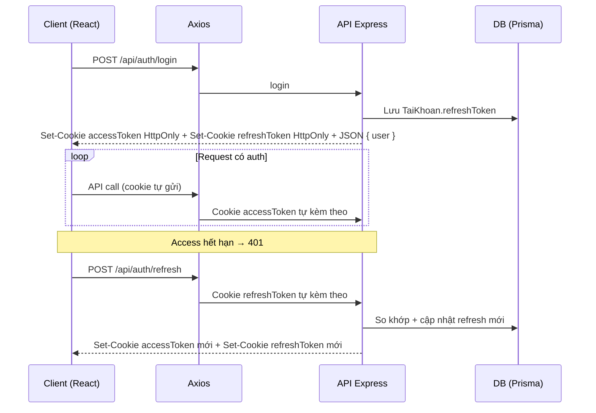

# Luồng xác thực JWT: Access Token & Refresh Token (Dual HttpOnly Cookie)

Tài liệu này mô tả **cách dự án thiết kế** cặp token, **chỗ lưu trữ**, **vì sao** lại chia như vậy, và **luồng** từ đăng nhập đến làm mới token khi hết hạn. Dùng để tra cứu nhanh khi quên.

---

## 1. Hai loại token làm gì?

| Token | Độ nhạy cảm / thời gian sống (tuỳ cấu hình `.env`) | Vai trò |
|--------|-----------------------------------------------------|---------|
| **Access Token** | Ngắn hạn (ví dụ vài phút đến ~15 phút) | Gửi kèm mọi API cần đăng nhập qua **HttpOnly Cookie**. Server đọc `req.cookies.accessToken` và verify bằng `jwtAccessSecret`. |
| **Refresh Token** | Dài hạn (ví dụ 7 ngày) | Chỉ dùng để **xin access token mới** khi access hết hạn. Gửi qua **HttpOnly Cookie**. Server verify bằng `jwtRefreshSecret` và **so khớp với DB**. |

---

## 2. Sau đăng nhập, token đi đâu?

### 2.1. Backend tạo token và lưu refresh vào DB

**File:** `server/src/services/auth.service.js`

- Hàm `generateTokens(taiKhoanId)` tạo JWT access + refresh.
- Sau khi login đúng email/mật khẩu, `login()`:
  - Gọi `generateTokens`
  - **Ghi `refreshToken` vào cột `TaiKhoan.refreshToken`** (Prisma `update`).

Mục đích lưu DB:

- Biết **một** refresh hợp lệ hiện tại cho user (hỗ trợ **xoay refresh** — mỗi lần refresh là token mới).
- **Đăng xuất / thu hồi:** set `refreshToken = null` → mọi cookie cũ không còn dùng được.
- **Chống dùng lại token cũ:** khi refresh, server so `cookie === DB`; khác thì từ chối (giảm thiểu hậu quả nếu token bị lộ).

### 2.2. Backend gửi CẢ HAI token qua Cookie (HttpOnly)

**File:** `server/src/controllers/auth.controller.js`

- `login`:
  - `res.cookie("accessToken", accessToken, ACCESS_COOKIE_OPTIONS)` với `httpOnly: true`, `sameSite: "strict"`, `secure` bật ở production, `maxAge: 15 phút`.
  - `res.cookie("refreshToken", refreshToken, REFRESH_COOKIE_OPTIONS)` với `httpOnly: true`, `sameSite: "strict"`, `secure` bật ở production, `maxAge: 7 ngày`.
- Response JSON **chỉ** trả `{ user }` — **KHÔNG** trả bất kỳ token nào trong body.

Mục đích cookie HttpOnly:

- Trình duyệt **tự gửi** cookie khi gọi API (cùng site hoặc CORS đúng cấu hình).
- **JavaScript không đọc được** nội dung cookie → **chặn XSS hoàn toàn** — kẻ tấn công không thể dùng `document.cookie` hoặc JS injection để đánh cắp token.
- Kết hợp `sameSite: "strict"` → **chặn CSRF**.

### 2.3. Frontend KHÔNG lưu token (hoàn toàn dựa vào cookie)

**Không có lệnh nào lưu token ở frontend.** Token nằm hoàn toàn trong HttpOnly Cookie do browser quản lý. JS không đọc được, không cần lưu.

**File:** `client/src/stores/useAuthStore.js`

- `setAuth(user)` chỉ lưu thông tin user vào Zustand state.
- **Không có `localStorage.setItem("token", ...)`** — không lưu token ở bất kỳ đâu trong JS.

**File:** `client/src/services/api.js`

- Axios instance cần set `withCredentials: true` để browser gửi cookie tự động.
- **Không cần `Authorization: Bearer` header** — server đọc token từ cookie.

---

## 3. Vì sao refresh vừa DB vừa Cookie? (tóm tắt một câu)

- **Cookie:** để trình duyệt gửi refresh **an toàn với JS** (HttpOnly) khi gọi endpoint refresh.
- **DB:** để server **kiểm soát phiên** — một refresh đúng tại một thời điểm, huỷ khi logout, xoay token khi refresh.

Hai nơi **không trùng ý nghĩa**: cookie là "mang theo request", DB là "nguồn sự thật phía server".

---

## 4. Vì sao access CŨNG để HttpOnly Cookie?

Đây là **lựa chọn bảo mật cao nhất** cho SPA:

| So sánh | localStorage | HttpOnly Cookie |
|---------|-------------|-----------------|
| XSS | ❌ JS đọc được → bị đánh cắp | ✅ JS **không đọc được** |
| CSRF | ✅ Không bị (vì cần JS gắn header) | ✅ Chặn bằng `sameSite: strict` |
| Gửi kèm request | ❌ Phải gắn header thủ công | ✅ Tự động |
| Mất khi refresh trang | ❌ Không (nhưng XSS risk) | ✅ Không (cookie still valid) |

**Kết luận:** Dự án chọn hướng **cả access + refresh đều HttpOnly Cookie** để bảo mật tối đa.

---

## 5. Luồng chi tiết (từng bước)

### 5.1. Đăng nhập

1. Client: `POST /api/auth/login` body `{ email, matKhau }`.
2. Route: `server/src/routes/auth.routes.js` → `auth.controller.login`.
3. Service `auth.service.login`: kiểm tra user, bcrypt, `generateTokens`, **update DB** `refreshToken`.
4. Controller: `res.cookie("accessToken", ...)` + `res.cookie("refreshToken", ...)` + JSON `{ user }`.
5. Client: nhận user info → `setAuth(user)` → **không lưu token** (cookie tự quản lý).

### 5.2. Gọi API khi đã đăng nhập

1. Mỗi request qua axios instance `api.js` (với `withCredentials: true`): browser tự gửi cookie `accessToken`.
2. Route được bảo vệ: middleware `authenticate` đọc `req.cookies.accessToken` → verify JWT.

### 5.3. Access hết hạn → làm mới (refresh)

**Backend (đã có):**

1. Client: `POST /api/auth/refresh` — **không** cần header Authorization; cả 2 cookie tự gửi.
2. Controller đọc `req.cookies.refreshToken` → `authService.refreshAccessToken`.
3. Service:
   - `jwt.verify` refresh.
   - Load user, **`taiKhoan.refreshToken === cookie`** — sai thì 401.
   - `generateTokens` mới → **update DB** refresh mới (**rotation**).
4. Controller: set 2 cookie mới (`accessToken` + `refreshToken`) → trả `{ message }`.

**Frontend (cần implement):**

- Interceptor response: nếu 401 do hết hạn access → gọi `/auth/refresh` với `withCredentials: true` → cookie mới tự set → **retry** request ban đầu.
- Tránh vòng lặp vô hạn nếu refresh cũng 401 (logout / redirect login).

### 5.4. Đăng xuất

1. Client: `POST /api/auth/logout` (cookie `accessToken` tự gửi kèm).
2. Service: `refreshToken = null` trong DB.
3. Controller: `clearCookie("accessToken")` + `clearCookie("refreshToken")`.
4. Client: `logout()` trong store → reset state UI.

---

## 6. Sơ đồ trình tự (Mermaid)

---

## 7. Bảng tra file nhanh

| Việc | File chính |
|------|------------|
| Tạo JWT access/refresh | `server/src/services/auth.service.js` (`generateTokens`, `login`, `refreshAccessToken`) |
| Set/xóa cookie access + refresh | `server/src/controllers/auth.controller.js` |
| Đọc accessToken từ cookie | `server/src/middlewares/auth.middleware.js` (`authenticate`) |
| Route login / refresh / logout | `server/src/routes/auth.routes.js` |
| Lưu user info (không lưu token) | `client/src/stores/useAuthStore.js` (`setAuth`) |
| Gọi login và `setAuth` | `client/src/pages/patient/LoginPage.jsx`, `client/src/pages/doctor/DoctorLoginPage.jsx` |
| CORS + cookie parser | `server/src/app.js` (`cookie-parser`, `credentials: true` trên cors) |

---

## 8. Checklist khi triển khai / ôn thi

- [ ] Login response **không** chứa token — chỉ trả `{ user }`.
- [ ] Browser nhận 2 cookie HttpOnly: `accessToken` (15 phút) + `refreshToken` (7 ngày).
- [ ] `POST /auth/refresh` gửi được cookie: cùng domain hoặc CORS + `credentials: true` trên axios.
- [ ] Production: `secure: true` cho cả 2 cookie (HTTPS).
- [ ] Có xử lý 401 + refresh + retry hoặc redirect login khi refresh thất bại.
- [ ] Logout gọi API → server clear 2 cookie + nullify DB refreshToken.
- [ ] `document.cookie` trong DevTools Console → **không thấy** accessToken hay refreshToken.

---

## 9. Liên quan trong repo

- Luồng chức năng tổng quát: `server/doc/FUNCTION_FLOW.md` (mục đăng nhập, refresh, logout).
- Postman: `server/doc/POSTMAN_TESTING_GUIDE.md` (test cookie).

*Tài liệu phản ánh cấu trúc code tại thời điểm cập nhật (chuyển sang dual HttpOnly cookie); nếu refactor auth, nên cập nhật lại mục 7 và 8 cho khớp.*
